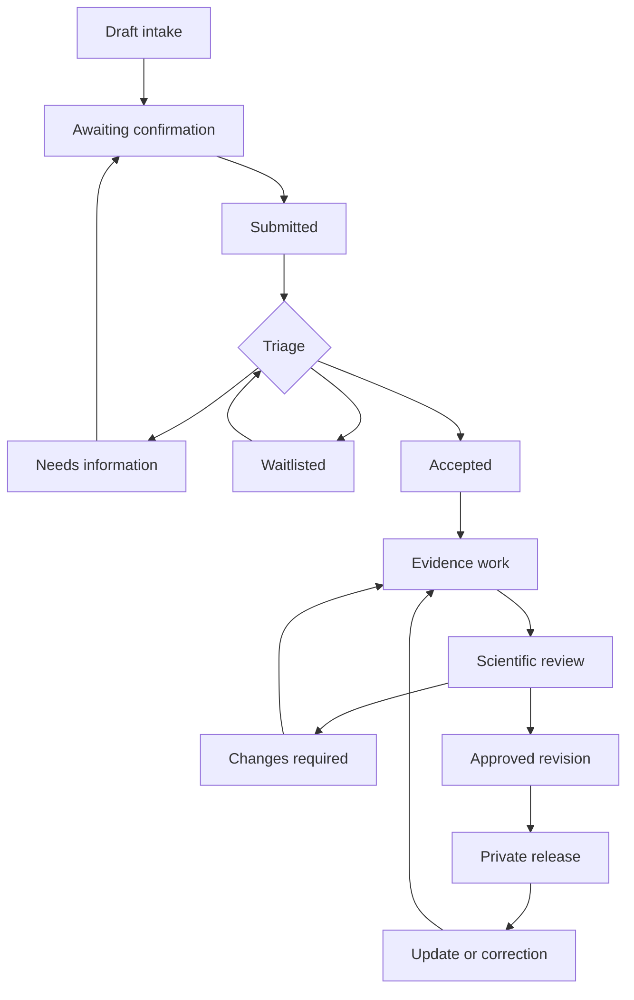

# Sanko Formulation Evidence — Implementation Plan and User Flows

**Version:** 1.0 · **Prepared:** 1 October 2026 · **Owner:** Felix Ayeni / Sanko
**Status:** implementation specification; no feature implementation or deployment is claimed.
**Suggested repository location:** `docs/SANKO_FORMULATION_EVIDENCE_IMPLEMENTATION_PLAN.md`

## 1. Implementation brief

Build an optional, private evidence-review service around a practitioner's saved formulation. Sanko should help the practitioner understand what published research says about its ingredients, how directly that research applies to the exact formulation, what remains unknown, and what investigation is appropriate next. AI may assist retrieval, extraction and drafting. An authorised human must review and approve each released report.

The product name is **Sanko Formulation Evidence Dossier**. Practitioner-facing entry copy is **“Request an evidence review.”** Do not call this automatic scientific validation, certification, proof of efficacy, regulatory approval or a published research paper.

The first release produces:

1. A plain-language practitioner evidence brief.
2. A technical dossier, including a reproducible search record, evidence tables, limitations and references.

Later releases support separately reviewed product-information leaflet drafts, regulatory-preparation reports, permissioned research sharing, and updates from new evidence. These are distinct outputs with different release requirements. They must not be generated by merely changing the title of the technical dossier.

Core practitioner access remains free. Review capacity may be limited by available staff and programme funding. Sponsor payment never grants access to private knowledge or influence over findings.

## 2. Verified repository baseline and branch decision

Repository inspected: `https://github.com/foayenix/sanko-core`. All three observed branches were checked on 1 October 2026. This inspection establishes source-code state, not production deployment state.

| Branch | Observed commit | Relationship and relevance |
| --- | --- | --- |
| `main` | `5dddddfe0ee74129c4bb907db4de28681f92645f` | Default branch; existing Vault, agent, provenance, plant resolver, admin and migrations through 019. |
| `claude/peaceful-mendel-cj9z1u` | `1e12abb809d1bf93b4504d0ca4ad6bdc2416efea` | Ancestor of inspected main; zero commits ahead and one behind. Do not merge it again to recover already integrated work. |
| `codex/patient-continuity` | `811fb3be7ce2789963a777ade4385f038dc92920` | One commit ahead of inspected main, zero behind. Adds source-of-truth and continuity specifications, migrations 020–021, and gated synthetic care workflows. |

**Recommended integration baseline:** the inspected patient-continuity branch, or its successor once incorporated into main. It contains relevant ownership, snapshot and care boundaries that this feature must preserve. This recommendation is not an instruction to merge, deploy or activate that branch automatically.

At implementation time, fetch current refs, identify the intended target branch, inspect its AGENTS.md, verify migration numbering and record the chosen commit. If development starts from main before continuity is integrated, implement the dossier as an independent module, reserve non-conflicting new migration numbers, and do not reference absent care tables. Keep the outcome-data bridge disabled. Do not silently copy or activate only part of the care branch.

Read before changing code:

- `AGENTS.md`, `PRODUCT.md`, `PRIVACY.md`, `README.md`.
- `SANKO_SOURCE_OF_TRUTH.md` on the continuity branch.
- `docs/MIGRATION_BACKLOG.md` and `docs/REPOSITORY_TRANSFER.md`.
- `docs/CARE_IMPLEMENTATION.md` and `docs/SANKO_PATIENT_CONTINUITY_IMPLEMENTATION_PLAN.md` when present.

### 2.1 What exists and how to extend it

| Existing location | Observed responsibility | Implementation direction |
| --- | --- | --- |
| `src/agent/tools.js` | Formulation save/read/update, patient tools, export/delete, gated tool selection | Add narrow dossier request/status tools. No model-accessible approval, permission-granting or release tools. |
| `src/prompts/agent.txt` | Practitioner agent instructions | Add bounded evidence-review intent and plain-language explanations; enforce actual rules in code. |
| `src/services/supabase.js` | Practitioner-scoped persistence, formulation retrieval, storage, export/deletion | Reuse infrastructure; create explicit evidence store/service boundaries. Extend rights handling. |
| `src/utils/plantLookup.js`, `data/plants/` | Name resolution, sources, taxonomy and human-review records | Preserve identity uncertainty and data versions. A name match is not botanical authentication. |
| `scripts/discover-sources.js` | Europe PMC/Crossref discovery for plant-name evidence | Reuse provider/parsing ideas after review. It is not a formulation efficacy-review engine. |
| `src/services/llm.js` | Model-provider abstraction | Reuse behind a dossier-specific privacy policy and structured-output validation. |
| `src/services/governance.js` | Contributor-terms eligibility and knowledge-use records | Preserve existing restrictions. Add purpose-specific service authorisation; external use remains separately governed. |
| `src/admin.js`, `src/adminPage.js`, `src/utils/adminAccounts.js` | Operator control room; named account references with a legacy Basic Auth fallback | Link to a new evidence workbench. Existing login alone does not establish scientific competence or dossier assignment. |
| `src/router.js`, `src/services/baileys.js` | Inbound durability and channel routing | Preserve deduplication/recovery; evidence tools are available only in the Vault context. |
| `src/care/*`, migrations 020–021 | Separate identity/session and care workflow, explicitly synthetic-only | Reuse tested design patterns, not live authorisation. Do not enable real care as a side effect. |
| `src/dashboard.js` | Public aggregates | Never expose private dossiers, ingredient combinations or reviewer notes here. |
| `sanko-landing page/src/views/*` | Future-state persona demonstrations | These are not an authenticated institutional portal. Do not attach private data to them. |
| `scripts/migrate.js` | Ordered, checksum-ledger migrations | Add migrations; preserve existing filenames/checksums and the historical numbering gap. |

Current formulations are mutable rows with `plants`, `preparation`, `dosage`, source and owner fields. The care branch has treatment-time preparation snapshots, but this is not a general dossier-version system. Add an immutable evidence snapshot without rewriting historical care notes.

No production configuration, applied migration ledger, live database, staffing, legal approval or deployed branch was verified for this plan. Repository test records are not a fresh verification of this feature.

## 3. Product boundaries and non-negotiable rules

1. Literature synthesis is not new experimental evidence. A dossier is not automatically a peer-reviewed publication.
2. Ingredient findings do not establish efficacy, safety or synergy of the whole formulation.
3. Record evidence separately for the exact formulation, comparable mixtures, individual ingredients, isolated compounds and practitioner observations.
4. Never invent identity, quantities, dose, duration, shelf life, contraindications, safety conclusions, laboratory findings or citations.
5. Missing evidence means uncertainty, not safety, and not proof that a treatment cannot work.
6. Review includes unfavourable and conflicting evidence. A reviewer can release a report concluding that the formulation cannot currently be assessed.
7. Save truthful partial formulations as today. Evidence-review readiness must not become a barrier to using the Vault.
8. Practitioner confirmation validates the recorded recipe/account. Scientific approval validates the review process and conclusions. Neither is regulatory approval.
9. Private by default. Review-service access, third-party research, publication, commercial use and model training are separate purposes.
10. Human approval binds an exact immutable report revision and output audience. Subsequent edits invalidate approval for the edited version.
11. The AI cannot approve itself, change permissions, approve release, publish, contact partners, or infer consent from a conversation.
12. No automatic treatment recommendations, formulation optimisation, dose-setting or patient-specific interaction decisions in this feature.
13. Preserve local terminology and practitioner attribution; distinguish practitioner account, botanical identification, published evidence and reviewer inference.
14. A sponsor may fund a review without receiving the recipe or report. Negative results remain eligible for support.
15. Private formulation data, report extracts, source PDFs and patient records must never enter Git, public demo fixtures, plant-build outputs or training exports by default.

## 4. Scope and release sequence

| Release | Included | Explicitly excluded |
| --- | --- | --- |
| E0: synthetic vertical slice | Fictional recipe → request → snapshot → manual source entries → draft → independent review → private release; all paths persisted and authorised | Real formulation intake, external sharing, live notifications, product leaflets, patient data |
| E1: staffed private pilot | Selected practitioners, real service authorisation, manual/human-assisted searches, brief + technical dossier, private download, corrections and version updates | Broad launch, automatic evidence monitoring, external access, patient-facing leaflets, regulatory claims |
| E2: evidence assistance | Qualified search providers, AI extraction/drafting, public-source reuse, bounded worker jobs, reviewed language outputs and update discovery | Automatic approval; unsupervised alerts about clinical risk |
| E3: governed derivative outputs | Recipient-bound sharing, leaflet drafts, regulatory-preparation reports, programme funding administration | Guaranteed registration, public formulation marketplace, unconsented licensing |
| E4: longitudinal evidence | Separately approved observational/lab-data attachments, version-specific evidence updates, programme analytics | Causal efficacy claims from routine follow-up; activation of unqualified care functions |

Ship a complete E1 workflow before adding breadth. E1 can operate without an AI model and without live patient-continuity access. Implement its manual path first so model/provider failure cannot stop human review.

## 5. Roles and permission model

Roles are capabilities assigned to authenticated identities, not strings accepted from a browser or model. A person can hold multiple roles, but must act in an explicit role/context. Assignment to one dossier grants no access to another practitioner's records.

| Actor | Allowed | Not allowed |
| --- | --- | --- |
| Practitioner / verified Vault owner | Request own review; confirm recipe; answer questions; see released outputs; request corrections; authorise exact sharing later | See reviewer-only drafts by default; scientifically approve solely through ownership; access another Vault |
| Delegated assistant | Prepare intake and relay attributed information within an explicit delegation | Invent consent, confirm as the owner, export or share without separately granted capability |
| Evidence analyst / author | Work on assigned dossiers; search, extract, assess and draft; request information | Release their own draft; browse all Vaults; change the practitioner's formulation silently |
| Scientific reviewer | Review assigned revisions, verify evidence, request changes, sign decisions within recorded competence | Approve an unassigned dossier; certify regulatory approval; silently edit after signing |
| Botanical specialist | Resolve identity questions with method, evidence and confidence | Treat a local-name mapping or photo guess as conclusive authentication |
| Clinical / regulatory specialist [E3] | Review output-specific safety wording or jurisdiction-specific preparation documents | Approve outside recorded scope or replace a regulator's decision |
| Programme administrator | Manage capacity, assignment, reviewer eligibility, programme budgets and delivery status | Obtain content access or scientific signing authority solely by being an administrator |
| Release manager | Release the exact approved artifact after all checks, or return a blocking issue | Override missing or invalid scientific approval |
| Research / pharma recipient [E3] | Access exact explicitly shared artifact for a recorded purpose and period | Browse private Vaults, access future revisions, receive patient records, redistribute beyond agreement |
| Sponsor [E1/E3] | Receive agreed non-identifying programme reporting | Access recipes or reports because they paid |
| Patient / public visitor | No dossier access in E1; later only an explicitly authorised patient-facing document | See private technical recipes through care consent or a public link |

E1 requires author and scientific approver to be different people. If Sanko has one available person, that person can prepare a draft and arrange external review; the report remains pending until a qualified second person signs. The reviewer may also be the release manager, provided they did not author that revision. Approval means internal scientific review, not journal peer review.

Record verified reviewer identity, competency areas, verification date, verifier, conflicts of interest and active/suspended status. Public signature details are a separate approved display projection. Do not publish authentication identifiers or assume existing `OP-*` references convey professional qualifications.

## 6. Detailed user-flow catalogue

Each flow specifies entry, successful path and material alternatives. E1 is the default unless labelled later. Flow numbers are traceability identifiers for implementation tickets and acceptance tests.

### F01 — Discover the service after saving a formulation

**Actor/entry:** practitioner has successfully saved or retrieved an owned `FM-` record.

1. Preserve the existing save confirmation. If pilot eligibility and review capacity allow, offer “Request an evidence review” and “Maybe later.”
2. Explain: “We can review published research relevant to your formulation. A human reviews the report. It may find useful evidence, risks or gaps; it does not certify the product.”
3. Selecting the offer opens intake; it never queues research or authorises access automatically.
4. Allow later entry by “Research FM-00034,” a list of owned formulations, or a private evidence portal.

**Alternatives:** feature off → no offer; full queue → honest waitlist invitation; decline → normal Vault use. Do not repeatedly prompt after every edit. No unsupported delivery-time promise.

### F02 — Select formulation, purpose and intended output

1. Resolve the formulation with owner-scoped lookup; an FM code is a locator, not a permission.
2. Ask whether the goal is understanding the evidence, planning research, preparing product information or preparing for a regulatory discussion.
3. E1 offers the practitioner brief and technical dossier. Other purposes can be recorded as future needs without suggesting those outputs are available.
4. Capture condition/topic of interest and jurisdiction only where relevant; keep it practitioner-reported.
5. Show what the review can cover and create a draft request.

**Alternatives:** unknown/other-owner/deleted record → neutral unavailable response; several records → ask which; vague purpose → general ingredient evidence review with scope documented. No private information in error messages.

### F03 — Resolve missing information with minimal friction

1. Check local names, mapped botanical candidates, plant parts, quantities/ratios, preparation, route, intended use and practitioner-reported administration.
2. Ask one focused question at a time in WhatsApp. Accept text, voice or source-page photographs through existing capture infrastructure.
3. Offer “I don't know” and “I prefer not to disclose.” Save either explicitly.
4. Show each proposed change and its source for practitioner confirmation. Use the existing correction path if changing the Vault; do not silently edit it from the dossier editor.
5. Assign identity verification tasks where ambiguity affects interpretation. Preserve unresolved ingredients rather than forcing a species match.

**Readiness levels:** `ingredient_overview` permits missing preparation/ratios with restricted conclusions; `formulation_assessment` requires sufficient confirmed composition and preparation to assess applicability; `product_output_ready` is a separate E3 specialist checklist. Readiness is not a safety grade.

**Alternatives:** ambiguous name → return relevant section for clarification or release a clearly limited overview; withheld ratios → proceed only at the justified scope; patient names in uploaded notes → redact/exclude before evidence processing. Original identity uncertainty remains visible.

### F04 — Confirm the recipe snapshot

1. Show the precise composition, parts, preparation and other supplied details, separating known, unknown and withheld fields.
2. Ask the owner to confirm this is the version to be researched.
3. Bind confirmation to the displayed content hash, source formulation revision and request ID.
4. Create an immutable snapshot in the same authoritative transaction as submission.

**Alternatives:** owner corrects → re-display and reconfirm; formulation changes meanwhile → revision conflict and new confirmation; assistant entered data → owner confirms; later changes create new snapshots, never rewrite this one.

### F05 — Authorise private review and enter the queue

1. Explain who at Sanko can see the recipe, why, what external processors are used, retention, and how cancellation works.
2. Explicitly state that requesting a private review does not authorise publication, external research access, commercial use or model training.
3. Record service-notice version/hash, purpose, scope, actor, language, channel, timestamp and confirmation.
4. Submit once using a durable idempotency key. Return request reference, scope and status.
5. If capacity is full, place on an opt-in waitlist with no false estimate. Record programme funding without transferring knowledge rights.

**Alternatives:** decline authorisation → preserve draft and Vault access, do not run jobs; cancel waitlist → withdraw; changed notice requiring renewed authorisation → pause before new processing. Broad contributor terms remain off and cannot be activated to make this flow work.

### F06 — Assisted onboarding and delegated intake

1. A support agent identifies themselves and their approved delegation.
2. They can collect source information and propose an intake draft in the practitioner's chosen language.
3. The owner reviews and confirms the recipe and service authorisation through a verified channel.
4. Audit both the entering person and the confirming owner.

**Alternatives:** practitioner cannot use a link → use an approved assisted verification/confirmation procedure; shared phone → do not assume the sender is the owner; authority cannot be verified → keep draft and route to support. No staff member impersonates the practitioner.

### F07 — Administrator triage and assignment

1. See a queue showing minimum operational metadata, readiness, requested purpose, age and programme.
2. Check capacity, authorised service scope, reviewer expertise, conflicts and unresolved identity tasks.
3. Assign an analyst and a separate eligible scientific reviewer; content access follows assignment and authorisation.
4. Request information or accept the scoped review. Give the practitioner a status update only through an authorised delivery path.

**Alternatives:** no qualified reviewer → wait or decline with reason; unusual safety/identity question → specialist task; conflict of interest → reassignment; service not suitable → explain and close, without labelling the formulation ineffective.

### F08 — Search published evidence

1. Analyst defines a search protocol: question, databases, synonyms, species/parts, preparation terms, condition terms, inclusion/exclusion rules and dates.
2. Search the exact formulation where possible, comparable mixtures, then ingredients and safety evidence. Proprietary recipes are not submitted wholesale to public search providers.
3. Log exact executed queries and dates, provider outcomes, deduplication and screening decisions.
4. Enter sources manually in E1; E2 may assist retrieval. Verify metadata, accessibility, retraction/correction status and source permissions.
5. Record no-result searches and coverage limitations.

**Alternatives:** full text unavailable → flag abstract-only; failed provider → retry or manual search and disclose coverage; retracted paper → exclude from supportive conclusions, retain the exclusion reason; contradictory finding → include and assess. A failed search is not “no evidence exists.”

### F09 — Extract findings and assess applicability

1. For each included source, record species, part, preparation/solvent, quantities or dose, route, study model/population, comparator, outcome and limitations as reported.
2. Link every finding to a source locator and the relevant ingredient or exact formulation snapshot.
3. Assign evidence category and applicability with an explanation. Separate study quality from match to this formulation.
4. Classify safety findings as observed clinical, case-report, preclinical, mechanistic/theoretical or not assessed.
5. Analyst verifies extraction. AI-generated assertions without retrievable support cannot enter a released report.

**Alternatives:** data missing → mark not reported; irrelevant plant part → indirect or not applicable; mechanism only → hypothesis; no study of exact mixture → explicit gap. Never infer synergy from ingredients acting on different pathways.

### F10 — Draft the practitioner brief and technical dossier

1. Build both outputs from the same structured evidence record and fixed snapshot.
2. Brief explains strongest relevant findings, important uncertainty and next steps in plain language.
3. Technical dossier includes all sections in section 7, the search method, applicability table and limitations.
4. Show “DRAFT — NOT REVIEWED FOR RELEASE” in every draft preview/export.
5. Analyst submits a specific revision for review with a change summary and unresolved questions.

**Alternatives:** little research → useful evidence-gap report; AI offline → manual editor remains usable; translation required → retain original and translation lineage, with human language review before release. No patient-use leaflet is produced in E1.

### F11 — Independent scientific review

1. Reviewer opens only assigned work, confirms competence and conflicts, and sees snapshot, sources, extraction, claims and draft together.
2. Verify substantive claims against accessible evidence, botanical uncertainty, preparation/dose relevance, study limitations, contrary evidence and safety wording.
3. Return structured comments as blocking or advisory; refer specialist questions as needed.
4. Decide `changes_required`, `approved_with_limitations` or `approved`; record reason and exact revision/hash.
5. A substantive revision requires renewed approval. Negative conclusions do not make a report unapprovable.

**Alternatives:** inadequate sources or unresolved material error → changes required; outside expertise → reassign/escalate; author attempts self-approval → denied; reviewer suspended → cannot sign or release; system audit failure → decision fails closed.

### F12 — Practitioner factual confirmation and disputes

1. Where review identified a factual issue about the recipe or traditional account, show only that issue to the owner.
2. Owner can confirm, correct or state uncertainty. Do not ask them to approve scientific conclusions.
3. Corrections affecting the recipe create a new snapshot/revision and return affected evidence to assessment.
4. Record disagreements about interpretation without deleting the reviewer finding.

**Alternatives:** owner requests removal of an unfavourable finding → record request; reviewer evaluates accuracy, not marketing preference; owner declines further disclosure → narrow scope or stop. No invented factual confirmation for unanswered questions.

### F13 — Release and retrieve the private report

1. Release manager checks current service authorisation, exact scientific approval, resolved blocking comments, source completeness, output audience, snapshot status and eligible signer.
2. Render immutable artifacts from the approved content; verify their content hash/manifest and layout before release.
3. Atomically record release, artifact references, review scope, limitations and audit/outbox event. Failed render/upload does not create a released record.
4. Practitioner receives a generic notification or sees status when they next ask. Private contents are accessed only after authentication/authorisation.
5. Show summary, full report, references, formulation version, review date, search cutoff, limitations and “Request a correction.”

**Alternatives:** notification fails → report remains released and notification retries; approval stale → release blocked; changed formula → display applicability warning and require update decision; access revoked/deleted → deny retrieval. No claim of delivery until channel acknowledges it.

### F14 — Corrections, amendments and withdrawal

1. Practitioner or reviewer reports an issue against an exact release, with reason and source.
2. Administrator triages severity; assigned reviewer checks scientific impact.
3. A routine correction creates a new revision; the old artifact remains historically identifiable until lawful deletion, with a superseded notice once replaced.
4. A material safety or integrity issue can withdraw current distribution immediately while investigation continues. Withdrawal and reason are audited; it is not an AI-only action.
5. Issue a reviewed replacement and notify authorised holders through the available delivery path.

**Alternatives:** unsubstantiated complaint → explain decision; unavailable practitioner → stop unsafe distribution while retaining appropriate audit; downloaded copies cannot be remotely erased. An old approval never covers an edited replacement.

### F15 — Formulation edit or new evidence triggers an update

1. On composition, plant-part, ratio, preparation, route or relevant use change, mark the dossier “Based on an earlier formulation version.”
2. Offer a scoped update; require snapshot confirmation and any new authorisation.
3. Reuse eligible public-source extraction where relevant, but reassess applicability and conclusions.
4. E2 monitoring can propose candidate papers or retraction alerts for human triage; it does not modify released findings.
5. Release a new version through the same independent review.

**Alternatives:** cosmetic name edit → record metadata change without unnecessary full review; no material new evidence → reviewed update note with new search cutoff; capacity unavailable → show pending status. Do not promise continual monitoring when no staffed service exists.

### F16 — Research / pharma sharing [E3]

1. Owner chooses a released output and a named recipient, purpose, expiry, permission to download, and whether composition is disclosed.
2. Show a redacted preview. Default to the minimum information needed for the purpose.
3. Check all required rights holders, project terms, permitted use, attribution, onward-sharing restrictions and any benefit-sharing arrangements.
4. Obtain explicit owner authorisation bound to the recipient and artifact hash; recipient verifies identity and accepts applicable terms.
5. Create revocable recipient-bound access. Log views/downloads and show access history to the owner.

**Alternatives:** missing rights/governance → do not share; recipient forwards URL → unauthorised person is denied; expiry/revocation → immediate server-side denial; later revision → requires new scope/authorisation. Revocation stops future Sanko access, not already downloaded copies. No automated partner outreach.

### F17 — Product-information leaflet draft [E3]

1. Start from a reviewed dossier, then collect verified product identity, composition, formulation/manufacturing specification, intended population, jurisdiction and permitted intended use.
2. Collect supported administration instructions, warnings, storage, stability/shelf-life evidence, manufacturer details and actual registration status where relevant.
3. Missing required product facts block a distributable output; offer an internal gap checklist.
4. Clinical and relevant regulatory reviewers evaluate a separate plain-language leaflet revision. Validate translation and readability with intended users.
5. Release only for its explicitly approved audience/status. A draft remains visibly labelled and unavailable through patient distribution routes.

**Alternatives:** no approved indication or unsupported dose → do not invent; status changes → re-review; product differs from the dossier snapshot → return for reassessment. Do not label this “NAFDAC-approved” without independently verified product-specific evidence.

### F18 — Regulatory-preparation report [E3]

1. Select jurisdiction and intended product category with a qualified regulatory reviewer.
2. Record the applicable source guidance, version/date and scope; keep it configurable rather than embedding a permanent universal checklist.
3. Map required evidence/documents to verified supplied items, missing items and items requiring specialist confirmation.
4. Link literature support to the correct section and separately list identity, quality, manufacturing, testing and other product-development gaps as applicable.
5. Export a dated preparation/gap report. State which items were assessed and which were not.

**Alternatives:** unclear category or changed guidance → pause conclusions; unsupported documents → not verified; external submission → separate action/authorisation, not an automatic consequence of export. Completion is not a prediction of approval.

### F19 — Add laboratory or patient-outcome evidence [E4]

1. Verify permission for the new evidence and match it to the formulation version/batch and study or observation period.
2. Lab evidence requires source report, method, sample identity, date and reviewer appraisal; an uploaded certificate is not automatically trusted.
3. Patient-outcome summaries require a separately approved governance and data-selection process; no automatic join against all care records.
4. Use aggregates with cohort definitions, denominators, follow-up coverage, missingness, adverse-event capture limitations and source attribution.
5. Label routine observations as observational; attach them as a separate evidence section and re-review the report.

**Alternatives:** wrong formulation version, absent permissions or incompatible observation methods → exclude and explain; identifiable patient data → exclude from the dossier by default. Keep the synthetic-only care release boundary intact.

### F20 — Cancellation, rights, export and deletion

1. Owner can cancel queued/in-progress work. Stop unclaimed jobs; active jobs recheck authorisation before persisting results.
2. Export includes owned snapshots, released reports, requests, permissions and permitted audit information, with third-party copyrighted material excluded where necessary.
3. Deletion freezes processing, revokes sessions/grants and removes private artifacts, cached content and derived records through a retryable workflow.
4. Apply an approved retention policy to narrowly required audit records; do not promise deletion of copies already held by third parties or immediate removal from immutable backups.
5. Show a truthful status and completion record. Do not report success after a partial storage failure.

**Alternatives:** lawful retention obligation → isolate and explain retained scope/time under approved policy; account recovery → verified support flow, not phone-only reassignment; owner requests public publication → separate publication and rights review, not a share-link toggle.

### F21 — Programme funding, capacity and service quality

1. Administrator configures a programme, eligible intake, reviewer capacity and funding limit.
2. Accept requests only within actual capacity or offer a waitlist. No practitioner checkout/paywall is introduced.
3. Track analyst/reviewer time and service costs per dossier; separate these from the clinical/scientific findings.
4. Report programme throughput and quality using privacy-preserving summaries.
5. Ask the practitioner whether the report helped and what action it enabled; use responses to improve service design.

**Alternatives:** funding ends → stop new intake or offer a clear waitlist, preserve owned reports; sponsor requests recipes → follow F16; sponsor asks for favourable conclusions → refuse and record conflict.

## 7. Required output specification

### 7.1 Practitioner brief

Aim for a useful 1–2 page summary, with an accessible in-app equivalent. This is an editorial target, not permission to omit material limitations. Include:

- Formulation/version and scope of review.
- What the practitioner told Sanko, clearly attributed.
- What relevant studies suggest and how directly they apply.
- Important risks, unknowns and identity/preparation mismatches.
- What the review cannot conclude.
- Prioritised next steps, such as confirming plant identity or obtaining product-specific testing.
- Scientific reviewer, review date, search cutoff and link to technical report.

### 7.2 Technical dossier

Mandatory sections, with explicit “not assessed” rather than empty sections:

1. Document control, confidentiality, owner/knowledge-holder attribution, snapshot and report version.
2. Executive summary and overall limitations.
3. Formulation specification; known, unknown and withheld values.
4. Traditional account and provenance, without presenting practitioner claims as literature findings.
5. Review question, protocol, search methods, screening, search dates and coverage limits.
6. Ingredient profiles: botanical identity, relevant chemistry, reported use, study findings and safety.
7. Whole-formulation evidence, comparable mixtures and evidence gaps.
8. Evidence-to-formulation applicability matrix.
9. Safety evidence and uncertainty, including interaction evidence strength and population gaps.
10. Quality/development gaps, distinguishing literature information from actual testing of this product.
11. Conclusions and prioritised research/development questions.
12. References, source locators, reviewer decisions, conflicts and revision history.

Required evidence table columns:

`Source | Study type | Species/part | Preparation/dose/route | Model/population | Comparator | Finding | Limitations | Match to this snapshot | Interpretation allowed | Reviewer status`

Interpretation examples use fictional data only:

- “A laboratory study of an ingredient used a different plant part. Its relevance to this formulation is uncertain.”
- “No eligible study of this exact mixture was identified within the documented search scope.”
- “Reported improvement in routine follow-up does not establish that the formulation caused the improvement.”

### 7.3 Evidence taxonomy

Store separate fields rather than one misleading numeric confidence score:

- `evidence_kind`: traditional account, ethnobotanical report, in-vitro, animal, human observational, human interventional, systematic review, reference monograph, analytical/quality study.
- `target_kind`: exact formulation, comparable formulation, ingredient, isolated constituent.
- `applicability`: direct, partial, indirect, unclear, not applicable; with rationale.
- `study_quality`: reviewer assessment plus domain-level limitations; do not invent validated grading scales.
- `finding_direction`: supportive, null, conflicting, adverse, descriptive, not assessable.
- `source_access`: full text, abstract only, metadata only. Metadata-only cannot support a substantive finding.
- `source_status`: active, corrected, retracted, questioned, unknown; checked date.
- `verification_status`: machine draft, analyst verified, reviewer verified.

An isolated compound mechanism cannot silently become an ingredient or mixture benefit. Absence of recorded harm cannot become “safe for everyone.” A clinical study on an ingredient is not a clinical trial of the practitioner's product.

## 8. State machines and concurrency

Use separate states for the request, scientific revision, artifact availability and jobs. Do not put everything into one `approved` boolean.



Cancellation is allowed before release and creates an audited terminal request status. Declined requests include a reason and can be resubmitted as a new request. A released version is superseded or withdrawn, never mutated back into a draft.

| Transition | Authorised actor | Transactional preconditions |
| --- | --- | --- |
| Draft → submitted | Owner through verified channel | Exact recipe and service confirmation, current owner, readiness scope, idempotency |
| Submitted/waitlisted → accepted | Programme admin | Capacity, active authorisation, eligible analyst/reviewer assignments |
| Drafting → review | Assigned analyst | Source/claim structure complete, content hash frozen, blockers enumerated |
| Review → changes required | Assigned reviewer | Current revision, reason and comments |
| Review → approved | Eligible assigned non-author reviewer | Required checks completed, no unresolved blocking findings, exact hash and scope |
| Approved → released | Release capability | Fresh authentication, valid approval, active authorisation, verified immutable artifacts and audit |
| Released → superseded | Release capability | Reviewed replacement released; maintain version link |
| Released → withdrawn | Authorised reviewer/release manager | Recorded integrity/safety reason; distribution disabled immediately |
| Active → cancelled | Owner | Scope validation; cancellation generation invalidates jobs/confirmations |

Use a numeric revision for mutable workflow records and explicit optimistic concurrency. Return `409 REVISION_CONFLICT` on stale writes. Never silently apply last-write-wins to approval, consent or recipe changes. Idempotency keys are unique per actor/action; changed payload under the same key conflicts.

Revision approval includes the content hash, snapshot hash, source-set/extraction manifest hash, intended audience, output kind and reviewed language. Cosmetic metadata changes must not alter signed content; anything that alters an artifact creates a new revision.

## 9. Proposed architecture and file-level work

Keep Node/CommonJS, Express and Supabase/PostgreSQL. Do not rewrite Sanko in Next.js or add a separate research platform for this release. A private `/evidence/` module can serve a small mobile-friendly interface, following the existing plain-browser care approach while keeping its own access boundary.

All paths below are **proposed additions**, unless named as existing in section 2.

| Proposed file/module | Responsibility |
| --- | --- |
| `src/evidence/config.js` | Flags, programme allowlist, provider policy, dependency validation |
| `src/evidence/auth.js` | Named human login, server sessions, CSRF and fresh-auth checks |
| `src/evidence/permissions.js` | Owner binding, assignments, role/capability checks, service scope and grant checks |
| `src/evidence/routes.js` | Private API and artifact delivery; strict validation and safe errors |
| `src/evidence/service.js` | Request/revision/review/release state transitions |
| `src/evidence/store.js` | Scoped database/RPC access; no general-purpose cross-owner fetch tools |
| `src/evidence/snapshots.js` | Canonical content serialization, immutable capture, source fingerprint comparison |
| `src/evidence/search.js` | Search protocol, provider adapters and retrieval records |
| `src/evidence/extraction.js` | Typed extraction, source locators and applicability checks |
| `src/evidence/drafting.js` | Bounded model assistance and manual drafting interface |
| `src/evidence/review.js` | Reviewer eligibility, comments, decisions and signed manifests |
| `src/evidence/render.js` | Deterministic report templates, private artifacts and integrity manifest |
| `src/evidence/worker.js` | Durable search/draft/render/notification jobs with leases and retries |
| `src/evidence/rights.js` | Export, cancellation, deletion and private-object inventory |
| `src/evidence/web/` | Owner portal, analyst/editor and review views; no embedded private demo data |
| `tests/evidence/*.test.js` | Meaningful permission, workflow, HTTP and PostgreSQL acceptance tests |
| `scripts/test-evidence-postgres.js` | Isolated real-SQL test runner |
| `scripts/preview-evidence.js` | Fictional local preview with no external messaging |

Existing edits:

- Mount `/evidence` in `src/index.js`; register worker lifecycle without blocking inbound chat turns.
- Add validated intent/tools in `src/agent/tools.js`, `src/prompts/agent.txt` and selected tool profiles.
- Add a neutral evidence-workbench link to `src/adminPage.js`; do not grant access through that link itself.
- Extend `exportAccount`, `createAccountExport` and `deleteAccount` paths in `src/services/supabase.js` to account for evidence objects and active work.
- Hook formulation edits/deletion into dossier currency checks, while independently rechecking source fingerprint on release/read so a missed hook cannot silently claim currency.
- Extend `.env.example`, `README.md`, test scripts and CI for the new module.
- Update `SANKO_SOURCE_OF_TRUTH.md` with the scoped decision, preserving implemented/proposed distinctions.
- Leave public dashboards and persona demos disconnected from private evidence data.

### 9.1 Authentication choice

Use individual Supabase Auth identities verified server-side, opaque hashed evidence-session tokens, exact-origin checking, session-bound CSRF, HttpOnly/Secure/SameSite cookies scoped to `/evidence`, and fresh login for review signing, release, external sharing and export. Default session lifetime: 30 minutes; privileged operation freshness: 10 minutes. These are proposed settings, not claims about current evidence functionality.

Create an explicit evidence-principal-to-Vault-owner binding after verification. Never infer it from matching phone/email, a care patient reference, a role selector or a client-supplied owner ID. Named reviewer capabilities are independently provisioned and checked each request.

Do not broaden `/care` cookies, remove its synthetic checks, or treat its synthetic fixtures as live reviewer identities. Avoid duplicated identity truth: future integration can map an evidence principal to an already verified platform actor through a reviewed adapter. Until then, evidence binding grants only evidence-module access.

WhatsApp can perform bounded intake through the current verified Vault context. Privileged service authorisation/recipe confirmation must use server-generated, short-lived single-use confirmations bound to the exact user, channel, payload and revision. For shared contacts or uncertain ownership, require verified portal/support confirmation. The model can request preparation of a confirmation; it cannot synthesise the user's confirmation. No full report text is placed in the general chat model's context.

### 9.2 Private processing and source reuse

- Default to local/private model processing, consistent with Sanko's posture. Do not inherit a cloud fallback that silently transmits recipes.
- Enforce per-job provider eligibility outside prompts. If approved processing is unavailable, queue or use manual work.
- Public-search queries must exclude practitioner identity, patient information, secret recipe ratios and unpublished combination details. A whole-formulation public search requires a separately reviewed disclosure policy or owner authorisation.
- Reuse bibliographic metadata and legally permitted public-source extraction, keyed by source version. Keep private interpretations, recipe matches and conclusions owner-scoped.
- Source acquisition is untrusted input: sandbox parsers, limit size/type, prevent SSRF/private-address fetches, and treat document instructions as data.
- Full texts and extracts must carry licence/access information. Do not bypass paywalls or put copyrighted books/papers into Git. Bibliographic metadata is not permission to redistribute a full text.

## 10. Data model and migrations

Use UUID primary keys, UTC timestamps, explicit ownership, immutable content hashes, foreign keys and constrained enums. JSONB is appropriate for versioned report content and source extractions with schema validation; keep permission, state and relationship fields relational.

Table names are proposals to reconcile against the implementation target. Do not assume migration numbers remain free. After the inspected continuity baseline, 022 onward are possible; allocate only after fetching current branches. Never repurpose missing historical number 017.

| Proposed entity | Minimum fields and invariants |
| --- | --- |
| `evidence_principals` | Auth user ID, active state, verified Vault owner binding if any, verification record. No self-assigned reviewer role. |
| `evidence_reviewer_profiles` | Principal, competence, verification, conflicts, active/suspended status; no public personal details by default. |
| `evidence_sessions` | Token/CSRF hashes, principal, created/authenticated/expires/revoked times. Never store raw tokens. |
| `evidence_confirmations` | Principal/channel, action, exact payload hash, request revision, expiry, consumed time. One use. |
| `formulation_evidence_snapshots` | Owner, formulation ID/code, source updated-at plus canonical fingerprint, composition/preparation/use, known/unknown/withheld fields, provenance, schema version, hash, confirmed-by/time. Immutable. |
| `evidence_requests` | Owner, snapshot, purpose, scope/readiness, state, programme, revision, authorisation reference, timestamps and cancellation generation. |
| `evidence_service_authorisations` | Owner, notice version/hash, purpose, processing scope, authorised roles/processors, language, method, evidence, grant/revocation times. No implied research/training rights. |
| `evidence_assignments` | Request, principal, capability, assigned/revoked times and assigner. Assignment is resource-scoped. |
| `evidence_search_runs` | Request, protocol version, provider/query records, timestamps, result counts, failures, screening scope and source-set hash. Queries may be confidential. |
| `evidence_sources` | DOI/PMID/PMCID/URL where available, title/authors/year, version, access/licence, correction/retraction status and check date. Public metadata only in shared rows. |
| `evidence_request_sources` | Request/source link, eligibility, inclusion/exclusion decision and reason; full-text storage reference where permitted. |
| `evidence_extractions` | Request/snapshot/source, locator, target, study attributes, finding, uncertainty, applicability and verifier. Preserve prior revisions. |
| `evidence_report_revisions` | Request, snapshot, revision, output kind/language/audience, content JSON, claims/source links, content/manifest hash, author and state. Frozen once submitted for review. |
| `evidence_review_decisions` | Revision/hash, signer principal, role/scope/competence snapshot, decision, blocking/advisory comments, reason, signed time. Append-only decisions. |
| `evidence_releases` | Exact approved revisions and artifact manifest, release scope/status, released-by/time, supersedes/withdrawal reason. No mutable artifact content. |
| `evidence_artifacts` | Owner/release, private object key, MIME type, size/hash, language/audience, retention/deletion state. No permanent public URL. |
| `evidence_jobs` | Owner/request/revision, kind, idempotency key, state, attempts, lease owner/expiry, cancellation generation, error class, timing and bounded cost. |
| `evidence_outbox` | Notification event, recipient binding, channel/consent, state, attempts, delivery reference; content-minimised. |
| `evidence_audit` | Actor/role, owner/resource, action, revision/hash, result/time and safe metadata. No raw recipe or credentials in audit payloads. |
| `evidence_rights_requests` | Export/deletion/recovery/cancellation scope, status, reviewer decisions, object inventory and completion record. |
| `evidence_programmes` | Sponsor/funding metadata, capacity, eligibility and budget; no implied content permission. |
| `evidence_access_grants` [E3] | Owner, recipient principal, purpose, exact artifact(s), redaction/disclosure, download policy, expiry/revocation, agreement and rights references. |

### 10.1 Database enforcement

1. Enable RLS and deny direct anon/authenticated access unless a specifically reviewed scoped policy exists. The trusted backend uses tightly validated operations; service-role bypass makes application scoping essential.
2. Scope every lookup by owner or an active verified assignment/grant. Use composite ownership relationships where feasible to prevent linking another owner's snapshot/source attachment.
3. Immutable snapshot/report enforcement belongs in database constraints/triggers or transactional functions, not just UI conventions.
4. Submission, approval, release, revocation and their audit entries must be atomic. A failed required audit write aborts the operation.
5. Restrict write functions to the trusted backend. If using security-definer functions, fix the search path and revoke unintended public execution.
6. Store revision/idempotency constraints in Postgres so multiple API/worker instances behave consistently.
7. No cross-practitioner deduplication of formulation snapshots. A private hash is not a public “same recipe” discovery feature.
8. Approval hashes cover extracted evidence as well as prose; editing a source interpretation after signing cannot silently alter a released output.
9. Distinguish preserved historical records from lawful erasure: immutability prevents ordinary editing, not an approved deletion workflow.

### 10.2 Migration sequence

- Migration A: evidence principals, bindings, sessions, confirmations, service permissions and audit.
- Migration B: immutable snapshots, requests, assignments and programme capacity.
- Migration C: sources, search records, extraction and report revisions.
- Migration D: review decisions, release/artifact inventory, jobs/outbox and rights workflow.
- Later migrations: recipient grants and derivative-output prerequisites; outcome bridge only after separate release qualification.

Do not mass-snapshot all existing formulations or silently consent existing users. Create a confirmed snapshot when a review is requested. Rehearse additive migrations and restore in a disposable database; preserve historical SQL checksums. Rollback disables new feature paths and jobs while retaining data safely; it does not drop report/history tables.

## 11. API, tool and UI contracts

Proposed private JSON envelope for mutations:

```json
{
  "action": "submit_request",
  "request_id": "<owned UUID>",
  "expected_revision": 3,
  "idempotency_key": "<client UUID>",
  "confirmation_token": "<server-issued single-use token>",
  "data": { "snapshot_hash": "<confirmed hash>" }
}
```

Actor, owner, reviewer identity and permission scope come from the authenticated context, never the request body. Strictly reject unknown fields. Treat all examples as proposed contracts, not existing endpoints.

| Proposed route/action | Purpose and access |
| --- | --- |
| `POST /evidence/api/login`, `logout` | Individual sessions; do not return provider/service credentials |
| `POST /evidence/api/prepare` | Exact-action confirmation for consent, submit, sign, release, share, export and delete |
| `POST /evidence/api/action` | Validated action dispatcher and transaction boundary |
| Owner actions | `list_owned`, `create_request`, `get_request`, `update_intake`, `confirm_snapshot`, `authorise_service`, `submit_request`, `cancel_request`, `request_correction`, `request_update`, `get_releases`, `request_export`, `request_deletion` |
| Staff actions | `queue`, `triage`, `assign`, `request_information`, `save_protocol`, `add_source`, `screen_source`, `save_extraction`, `save_draft`, `submit_review` |
| Reviewer actions | `review_detail`, `comment`, `request_changes`, `approve_revision`, `withdraw_release` |
| Release actions | `render_approved`, `verify_artifacts`, `release_revision`; each separately authorised |
| `POST /evidence/api/artifact` | Authorised download/view for exact release; stream through backend with fresh grant/status checks |
| E3 actions | `prepare_share`, `grant_access`, `revoke_access`, `accept_recipient_terms`, `request_leaflet`, `request_regulatory_report` |

Use opaque pagination cursors with stable timestamp/UUID ordering, bounded page sizes and fresh permission checks. No broad `select('*')` results returned to every role.

Error contract: 400 invalid input/action; 401 expired/revoked session or fresh login needed; 403 CSRF or insufficient verified permission; neutral 404 unavailable resource/feature; 409 stale revision, invalid state, duplicate-key mismatch or invalid confirmation; 422 insufficient supported source; 429 rate/capacity limit; 503 dependency/audit unavailable. Responses and logs must not reveal another owner's existence or content.

Agent tools are narrower than API actions:

- `start_evidence_request(formulation_code, purpose)` — draft only.
- `get_evidence_request(request_reference)` — owner-safe status and requested questions.
- `answer_evidence_question(request_reference, question_id, answer)` — attributed proposed answer; no silent recipe overwrite.
- `prepare_evidence_submission(request_reference)` — returns a human confirmation flow, not approval.
- `list_evidence_reports()` — released-report metadata only.
- `request_evidence_update(request_reference, reason)` — new draft update request.
- `request_evidence_correction(release_reference, reason)` — triage ticket.

A deterministic channel handler processes exact confirmations. A model-generated tool call must not impersonate the user's consent. Model retries and inbound-message recovery must return the same request instead of creating duplicate reviews.

### 11.1 Screen inventory

1. Owner: formulation evidence card with clear status and next action.
2. Owner: intake wizard, unknown/withheld options, snapshot comparison and service notice.
3. Owner: request timeline, outstanding questions, cancel/update actions.
4. Owner: released summary, technical report, versions, limitations and corrections.
5. Staff: capacity/triage queue with minimal metadata and assignment controls.
6. Analyst: source/search editor and evidence-to-formulation matrix.
7. Reviewer: side-by-side source/claim/revision view, comments and exact-content signing.
8. Release: artifact previews, unresolved blockers and release decision.
9. E3: recipient preview, permissions, expiry and access history.
10. E3: product/regulatory prerequisites with missing facts explicitly shown.

Design for mobile, plain language, keyboard access and readable botanical names with diacritics. Status must not rely on colour alone. Keep private data out of browser localStorage, analytics, error tracking payloads and public caching. Logout/session expiry must clear private DOM state, including restored/back-navigation views.

## 12. Jobs, storage and delivery

Research and rendering may outlast a chat turn. Do not perform the entire review synchronously in the WhatsApp webhook.

1. Persist accepted work and an idempotency key before acknowledging it.
2. Workers claim jobs transactionally with lease expiry and attempt limits; use heartbeat/reclaim for crashed workers.
3. Check active authorisation, owner state, cancellation generation and exact input revision when claiming and before publishing results.
4. Persist intermediate work with provenance. Provider failure leaves a resumable/manual path; it does not fabricate a completed search.
5. Back off bounded retries, move exhausted work to a visible manual queue, and track costs/time without logging recipes.
6. Deduplicate output artifacts by exact job/revision identity; never overwrite a released object key.
7. Render to staging, validate content/hash/layout, then atomically commit release metadata and an outbox item. Cleanup orphan staging objects safely.
8. Delivery failure must not undo a valid scientific release. Retried notification does not generate another release.

Use private object storage with an explicit inventory for every report, upload and extraction. Prefer backend-authorised streaming over long-lived signed URLs. The existing account-export URL pattern is not sufficient for revocable external dossier sharing: signed links can remain usable until expiry. If temporary signed URLs are needed internally, use short expiry and document that limit; do not treat URL possession as recipient identity.

MVP delivery is pull-based status/retrieval plus generic notifications only when the user has authorised them and an approved channel path is available. Current care code has no outbound Meta transport; do not imply that it does. Reuse an appropriate Vault messaging path only after reviewing current channel rules, approved templates/window requirements and privacy. Never send a complete secret recipe in an unsolicited notification.

## 13. Scientific and AI quality controls

Every substantive claim must link to a source or be explicitly marked practitioner account/reviewer inference. A DOI that resolves is insufficient: the source must support the actual claim, plant part, preparation and evidence type.

Automated checks should detect:

- Missing citations or source locators; source metadata mismatches.
- Human-efficacy language supported only by laboratory/animal evidence.
- Ingredient evidence relabelled as whole-formulation evidence.
- Unproven synergy, universal safety or unsupported dose/shelf-life statements.
- Missing known uncertainty, conflicting evidence or material limitations.
- Retracted/updated sources and unavailable full texts.
- An unconfirmed species replacing an ambiguous local name.
- Patient identifiers or private material leaking into exports, shared views or logs.
- Draft, translation or derivative output released under another version's signature.

These checks aid a reviewer; passing them is not scientific validation. Build a small adjudicated evaluation set with synthetic/publicly usable material covering these failure modes. Evaluate retrieval, extraction fidelity, citation support, applicability and language separately. Measure correction rates and critical error counts; do not invent an “accuracy” score from offline unit tests.

Store model/provider, prompt/schema version, source IDs and output revision for AI-assisted steps. Treat source documents as untrusted input. Do not permit tool instructions embedded in papers or uploaded notes to access records or change permissions. Train on neither reports nor reviewer corrections by default; a private review authorisation does not enable existing training exports.

## 14. Security, ownership and governance integration

### 14.1 Service authorisation versus external use

The private review is an optional service for the practitioner's benefit. It needs an approved service notice and explicit processing scope, including contracted reviewers/processors. This is not permission for a university, sponsor or company to use the knowledge for its own purposes.

The existing contributor terms are draft and disabled. Keep that state unchanged. New private-service permission is not a bypass of `src/services/governance.js`. E3 external sharing must satisfy existing eligibility where applicable plus purpose-specific recipient/rights/benefit-sharing checks. If those prerequisites are not in force, the external-sharing feature stays unavailable. Do not create dummy acceptance rows or automatically set `CONTRIBUTOR_TERMS_IN_FORCE=true`.

Document whether the practitioner is the sole rights holder or is recording family/community knowledge requiring additional authority. Unresolved rights block external use; do not demand public disclosure to receive the private service.

### 14.2 Important abuse/failure cases

- Other-owner FM/request/artifact IDs: neutral denial at every API/storage path.
- Privileged role sent in JSON: ignored/rejected; identity and capabilities resolved server-side.
- Legacy shared admin login: cannot approve or release scientific reports.
- Stale approval or revoked assignment: current permission checks deny action even with an old browser tab.
- Export/worker racing deletion: processing fence/cancellation generation and transactional checks prevent artifact resurrection.
- Expired/revoked share: backend denies access, including artifact download; audit permitted attempts without leaking content.
- Public plant build accidentally reading evidence tables: explicit module separation and regression test.
- Dossier used in a patient record: only a separately authorised patient-facing projection, never the private recipe by implication.

Require TLS, credential-safe errors, parser limits, rate limiting suited to deployment topology, no-store responses, content security policy, backup/restore rehearsal and an incident owner. Review log statements against existing privacy claims before live release.

## 15. Acceptance scenarios

Implement meaningful tests for the risks below. These are planned acceptance criteria, not completed test results.

| ID | Scenario | Required result |
| --- | --- | --- |
| AT01 | Feature off; existing practitioner saves/edits a formulation | Existing behaviour preserved; no request/job/notification created. |
| AT02 | Same WhatsApp request is replayed after process restart | One request and one job; stable returned reference. |
| AT03 | Owner requests another practitioner's FM code or report | Neutral denial; no content/existence leakage. |
| AT04 | Partial recipe has unknown part/ratio | Vault save works; scoped overview allowed with limitations, no invented fields. |
| AT05 | Local name has multiple candidates | No forced species; ambiguity visible through report. |
| AT06 | Assistant prepares intake | Owner confirmation still required; both actors attributed. |
| AT07 | Model attempts to confirm consent or approve | Denied outside deterministic human confirmation/reviewer path. |
| AT08 | Formula changes between preview and submit | 409 conflict; re-display and confirm new snapshot. |
| AT09 | Public search request contains secret recipe detail | Disclosure policy blocks/minimises outbound query; no hidden fallback. |
| AT10 | Source retrieval fails or full text unavailable | Accurate coverage/abstract-only status; no fabricated evidence. |
| AT11 | In-vitro ingredient evidence is drafted as clinical mixture efficacy | Release blocker and reviewer correction. |
| AT12 | Reviewer is the author, unassigned or suspended | Approval denied and audit recorded. |
| AT13 | Report/extraction changes after approval | Signature cannot release changed content; new review required. |
| AT14 | Concurrent draft saves/release requests | Revision conflict or idempotent result; no overwritten review history. |
| AT15 | Render/upload fails | No released artifact claim; retry/manual recovery without duplicates. |
| AT16 | Notification fails | Released report remains accessible; bounded retry with honest delivery state. |
| AT17 | Practitioner edits formula after release | Historical snapshot retained; current applicability warning and update flow. |
| AT18 | Unfavourable conclusion or no exact-formulation study | Report can be released with transparent limits; not rewritten as positive evidence. |
| AT19 | Released report withdrawn | Future retrieval/share distribution blocked or shows withdrawal notice; history audited. |
| AT20 | Owner revokes service while worker runs | Worker cannot commit new research/draft result after revocation boundary. |
| AT21 | Deletion with queued jobs and storage failure | Jobs fenced, resumable cleanup, no false success or artifact resurrection. |
| AT22 | Owner exports account | Includes permitted evidence records/artifacts; excludes other owners and restricted full texts. |
| AT23 | Session expires/logout/back navigation | Private DOM cleared; API access denied; no browser storage/cached report leak. |
| AT24 | Direct anon/authenticated SQL access or service-role API ID swap | Database denies direct paths; backend scoping prevents owner mismatch. |
| AT25 | Required audit write fails | Approval/release/permission transition rolls back. |
| AT26 | Evidence enabled while care remains off | E1 works without enabling real patient paths or changing care restrictions. |
| AT27 | External sharing disabled / contributor terms still draft | All external-share APIs reject; no UI-only protection. |
| AT28 [E3] | Shared URL forwarded or grant expired/revoked | Recipient binding and artifact checks deny unauthorised access. |
| AT29 [E3] | Leaflet lacks verified dose/shelf life/required product facts | Gap report only; no distributable leaflet or invented values. |
| AT30 [E3] | Regulatory guidance or product classification changes | Dated checklist reassessed; no persistent approval claim. |
| AT31 [E4] | Outcome data from wrong version or without permission | Excluded; no automatic care join or causal claim. |
| AT32 | Sponsor requests confidential contents or positive result | No automatic access; scientific review remains independent. |
| AT33 | Backup restore and worker restart | Preserves snapshot/release hashes, permission state and idempotency. |
| AT34 | Input paper contains prompt injection or malicious URL | No privileged action/private network fetch; safe parsing and review queue. |
| AT35 | Translation changes a safety caveat | Translation cannot inherit English approval; reviewed language-specific release required. |
| AT36 | Legacy export/training or public dashboard runs | No dossier content or private evidence enters those outputs without explicit authority. |

Verification layers:

1. Unit tests for state/claim/validation rules with synthetic fixtures.
2. Real disposable PostgreSQL tests for owner constraints, RLS/RPC permissions, concurrency, transaction/audit failure and migration restore.
3. HTTP tests for sessions, origin/CSRF, fresh-auth, artifact access and no-store behaviour.
4. End-to-end browser run: request → question → owner confirmation → authorisation → queue → evidence → draft → independent review → release → owner retrieval → correction/update.
5. Human scientific review of representative sample dossiers and language/usability review with practitioners.
6. Authorised provider/channel tests only when those integrations are being enabled; no production messages in automated tests.

Use the repository's existing required commands after backend implementation:

```sh
npm run lint
npm test
npm run check-secrets
npm run check-repository
```

Add `npm run test:evidence` and a safe isolated database runner as implementation work. Run existing care SQL regression tests if using the continuity baseline or changing shared identity/routing/rights code. Run landing lint/build only if that project is edited. Passing software tests does not validate medical conclusions or qualify a production service.

## 16. Implementation backlog and definition of done

| Ticket | Deliverable | Dependencies | Completion evidence |
| --- | --- | --- | --- |
| E00 | Refresh branch/commit inventory; read repository rules; record migration ledger assumptions | None | Baseline note; no unsupported production claim |
| E01 | Agree E1 scope, service authorisation, reviewer responsibilities and pilot capacity | E00 | Approved operational inputs; draft/no-live state until resolved |
| E02 | Evidence auth, explicit owner binding, capabilities, confirmation and audit foundations | E00 | Permission/session/CSRF and direct-SQL denial tests |
| E03 | Add immutable snapshots and request state machine | E02 | Owner isolation, stale confirmation and immutable-history tests |
| E04 | Practitioner WhatsApp intake and private request screens | E03 | F01–F06 end-to-end, duplicate/recovery scenarios |
| E05 | Queue, programme capacity, reviewer profiles and assignments | E02–E04 | Role/assignment and no-self-approval checks |
| E06 | Manual search/source/extraction editor and applicability matrix | E05 | Traceable sample review; negative/no-evidence cases |
| E07 | Manual report editor, brief/technical templates and draft markings | E06 | Complete source-backed draft and content manifest |
| E08 | Independent review, exact-revision signing and release gating | E07 | AT12–AT15, AT25; no model or legacy-admin approval path |
| E09 | Private artifacts, owner retrieval, versions and notification outbox | E08 | Private download, failed delivery/retry and no-store checks |
| E10 | Corrections, currency detection, cancellation, export and deletion | E09 | AT17–AT23 and restore; no worker resurrection |
| E11 | Synthetic preview, full acceptance and practitioner/scientific evaluation | E04–E10 | E0 end-to-end evidence and documented limitations |
| E12 | Staffed E1 live pilot release | E01 and E11 | Release checklist satisfied for actual pilot environment |
| E13 | Qualified provider search and AI assistance | Stable E1 | Evidence extraction/citation evaluations, privacy and failure tests |
| E14 | External research sharing | E13 plus E3 governance/identity qualification | Recipient-bound scope, revoke/expiry and rights checks |
| E15 | Leaflet and regulatory-preparation outputs | E14 plus specialist workflows | Product/jurisdiction prerequisite checks and separate approvals |
| E16 | Lab/outcome updates and monitoring | Separately qualified E4 dependencies | Version linkage, provenance, permission and observational limits |

Do not schedule every later ticket into the first sprint. The first useful completed slice is one fictional formulation producing an independently reviewed private dossier through real persisted states. Then use the practitioner's actual formulation in the approved E1 pilot.

### 16.1 Suggested configuration names

All are proposed, default off unless stated. Add names to `.env.example` without credentials.

```dotenv
EVIDENCE_ENABLED=false
EVIDENCE_SYNTHETIC_ONLY=true
EVIDENCE_LIVE_PILOT_ENABLED=false
EVIDENCE_AI_ENABLED=false
EVIDENCE_EXTERNAL_SEARCH_ENABLED=false
EVIDENCE_NOTIFICATIONS_ENABLED=false
EVIDENCE_EXTERNAL_SHARING_ENABLED=false
EVIDENCE_PRODUCT_LEAFLETS_ENABLED=false
EVIDENCE_REGULATORY_REPORTS_ENABLED=false
EVIDENCE_OUTCOME_LINKING_ENABLED=false
EVIDENCE_ORIGIN=
```

Require explicit pilot allowlisting and completed operational prerequisites for live E1. Reject incompatible configuration at startup. Enabling a later flag without implemented prerequisites must fail closed. These flags never switch on `CARE_*` or contributor terms. Keep privileged review/release unavailable until named competent reviewers and exact-content signing are configured.

## 17. Pilot design, measures and release gates

Start with the practitioner's existing formulation after identity, purpose and review-service authorisation are established. Then consider a small pilot of roughly 3–5 practitioners and 5–10 formulations if staffing permits. These are proposed pilot sizes, not achieved adoption or statistical validation.

Track:

- Saved formulation → requested review → completed intake → released report → report opened.
- Clarification burden, abandonment reasons and assisted versus independent completion.
- Analyst/reviewer hours, waiting time, revision cycles, provider/model/render costs.
- Unsupported-claim/citation corrections and severity; zero unresolved critical release blockers.
- Usefulness reported by practitioners and independent researchers; actual next actions enabled.
- Repeat retrieval/update requests and continued formulation documentation, without attributing retention changes causally from a tiny pilot.
- Confidentiality incidents, inappropriate-access attempts and revocation/deletion completion.

Cost per completed dossier = analyst time + reviewer/specialist time + provider/model/storage/render costs + allocated support. Measure the components before promising unlimited service or setting institutional prices. Reuse verified public evidence to reduce effort while reassessing every formulation's applicability.

Before a live E1 pilot:

- [ ] Chosen deployment commit and applied migrations verified in the intended environment.
- [ ] Private-service notice and processing arrangements approved; rights/retention/incident processes assigned.
- [ ] Named analyst and independent scientific reviewer available with appropriate competence.
- [ ] Verified owner/reviewer enrolment and recovery process operational.
- [ ] Private storage, processor routing, backup restore and deletion tested.
- [ ] Complete synthetic flow and permission/concurrency acceptance passed.
- [ ] Report templates and example conclusions reviewed by a qualified human.
- [ ] Pilot capacity, honest turnaround communication and support channel established.
- [ ] No live patient linking, external sharing, automatic training or contributor-term activation.

Before E3: approved recipient/rights agreements, specialist review coverage, current jurisdiction-specific guidance, grant enforcement and output-specific release tests. Before E4: separately qualified care/research governance and version-specific data selection. These are implementation release requirements, not a request to pause preparation of this specification.

## 18. Open operational decisions and safe implementation defaults

| Decision to resolve | Safe default while building |
| --- | --- |
| Actual production branch and migration state | Use pinned source for planning; inspect deployment before release; no automatic merge/deploy |
| Scientific reviewer(s) and competence | Fictional test accounts only; no live scientific approval |
| Service notice, contracted reviewers and retention | Draft workflow only; live intake off |
| Public search / cloud-model disclosure | No private recipe outbound; local/manual work only |
| Pilot funding and capacity | Limited invite-only queue; core Vault stays free |
| Report language and translation review | English technical report; release another language only with appropriate review |
| Shared-phone/assisted identity procedure | Intake draft permitted; privileged confirmation deferred to verified process |
| Regulatory category/jurisdiction | Record intended jurisdiction; no generic compliance badge |
| Notification channel qualification | Pull-based status and authenticated retrieval |
| Rights in community/family knowledge | Private service within authorised scope; no external disclosure while uncertain |

## 19. Sources and maintenance

### Repository evidence

- [Main baseline](https://github.com/foayenix/sanko-core/tree/5dddddfe0ee74129c4bb907db4de28681f92645f).
- [Continuity integration baseline](https://github.com/foayenix/sanko-core/tree/811fb3be7ce2789963a777ade4385f038dc92920).
- [Implementation/release boundary](https://github.com/foayenix/sanko-core/blob/811fb3be7ce2789963a777ade4385f038dc92920/docs/CARE_IMPLEMENTATION.md).
- [Product source of truth](https://github.com/foayenix/sanko-core/blob/811fb3be7ce2789963a777ade4385f038dc92920/SANKO_SOURCE_OF_TRUTH.md).
- Source inspection included formulation persistence/tools, governance, auth/control-room foundations, care configuration/routes, export/deletion, migration runner, plant-source discovery and branch ancestry.

### Scientific/regulatory orientation

These sources informed the preceding concept discussion on 1 October 2026. They establish useful distinctions, not automatic applicability to an individual product. Recheck current product/jurisdiction-specific guidance during E3 implementation.

- [WHO monographs on selected medicinal plants](https://www.who.int/publications/i/item/9241545178): model for separating identity, medicinal use, quality and safety evidence.
- [WHO monographs, volume 4](https://iris.who.int/bitstream/handle/10665/42052/9789241547055_eng.pdf): distinctions among clinical support, established documents and traditional accounts.
- [NAFDAC application and guidance resources](https://nafdac.gov.ng/regulatory-resources/application-forms/): separate herbal registration, labelling and manufacturing guidance; a literature review is only one potential support component.
- [EMA herbal scientific guidelines](https://www.ema.europa.eu/en/human-regulatory-overview/research-development/scientific-guidelines/multidisciplinary-guidelines/herbal-medicinal-products-scientific-guidelines): reference for combination, quality and evidence-assessment distinctions; EU guidance is not Nigerian approval criteria.

Maintain a changelog as implementation proceeds. Record actual code/tests separately from intended features. Update baseline SHAs and numbered migrations once chosen; do not rewrite this plan to imply unperformed verification.

## 20. Coding-assistant handoff

> Implement Sanko Formulation Evidence according to this specification and the repository's AGENTS.md and product source of truth. First verify the current target branch and reconcile it with the pinned baseline. Preserve the existing CommonJS/Express/Supabase stack, free practitioner access, Vault permissions, channel durability, immutable care history and disabled live-care/contributor-term boundaries. Start with E00–E11 as a synthetic end-to-end slice, then prepare E1 live-pilot readiness. Build manual evidence entry before optional AI assistance. A model must never approve a report, grant permissions or infer consent. Require independent human scientific review bound to exact report, evidence and formulation versions. Keep patient-facing leaflets, regulatory reports, external sharing and patient-outcome integration gated to later releases. Use additive migrations and meaningful permission/concurrency tests. Report what works, what was tested and which operational release gates remain. Do not present this specification itself as implementation or deployment evidence.
