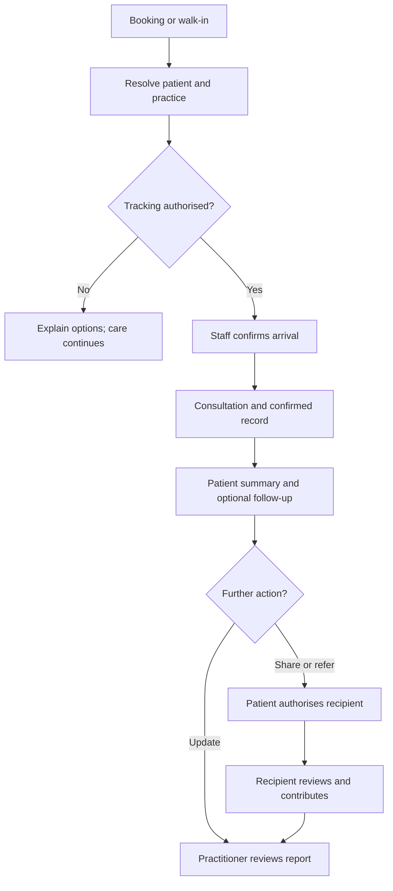

# Sanko: Patient Access, Visits and Continuity of Care

**Implementation specification and complete user-flow plan**\
Version: 1.0 · Prepared: 30 September 2026 · Owner: Felix Ayeni\
Repository: https://github.com/foayenix/sanko-core\
Suggested repository location: `docs/SANKO_PATIENT_CONTINUITY_IMPLEMENTATION_PLAN.md`

## 1. Purpose and status

Extend the existing Sanko build so practitioners receive immediate value from patient records, retrieval and follow-up, while patients can access their own information and selectively share it with participating professionals. Preserve Sanko's foundation: private practitioner knowledge, attributable formulation records and formulation-linked longitudinal observations for African traditional medicine.

This document plans implementation; it does not assert that proposed features are built, deployed, clinically validated or legally approved. The user has requested this plan, not a production deployment. Complete development in small, reviewable changes. Do not enable all phases together.

### The intended experience

A patient books or walks in, identifies themselves once, and has a visit recorded by the practice. A practitioner retrieves earlier information, confirms a brief visit note and links the preparation used. The patient can review the summary, report their experience and authorise a doctor, pharmacist or another practitioner to see selected records. A receiving professional records their own assessment, and authorised follow-up returns to the relevant care team.

### Product decisions carried forward from this conversation

- Keep core practitioner use free. Do not make research participation a condition of care documentation.
- Give patients one Sanko-wide reference, with distinct appointment and visit references.
- Support booking, walk-ins, practice invitations and patient-reported past visits.
- Register progressively during a useful action; do not demand a long form first.
- A booking is not proof of attendance. Attendance is not proof of a completed consultation.
- Patients can contribute information. Preserve whether it was patient-reported, practitioner-confirmed or extracted from a document.
- Share selected care information through explicit, scoped authorisation. A patient number or QR card is not an access credential.
- Keep private formulation knowledge separate from the disclosed preparation information needed for a patient's care.
- Plan pharmacist and doctor participation, referrals and interaction support in later phases.
- Measure repeat useful work, not message volume or account creation alone.

### Proposed defaults, not previously agreed policies

The schema names, API paths, pilot size, authentication design and operational targets below are recommendations for implementation. Keep them adjustable. Required local clinical, privacy and professional-verification policies must be established before real-patient rollout. Until then, develop and verify with synthetic records.

## 2. Repository baseline: verified observations

Inspected on 30 September 2026:

| Branch | Commit | Finding |
| --- | --- | --- |
| `main` | `5dddddfe0ee74129c4bb907db4de28681f92645f` | Default branch and recommended baseline |
| `claude/peaceful-mendel-cj9z1u` | `1e12abb809d1bf93b4504d0ca4ad6bdc2416efea` | No unique commits beyond main; file tree identical to main |

`git rev-list --left-right --count` returned `1 0`; direct tree diff was empty. No branch merge is needed for this plan. Recheck the remote before implementation because this is a pinned snapshot. Repository inspection does not establish which commit or configuration is deployed at sanko.africa.

| Area | Evidence in current build | Implication |
| --- | --- | --- |
| Runtime | CommonJS Node backend; `package.json` specifies Node >=20.19.0 and Express `^5.2.1`; README still says Express 4 | Reuse the installed/locked stack; reconcile stale documentation |
| WhatsApp | `src/router.js`, `src/services/whatsapp.js`; Baileys adapter and simulator also exist | Extend shared domain services across transports |
| Actor resolution | `processTurn()` handles consent responses then calls `getOrCreatePractitioner()` | General patient messages need explicit actor routing before practitioner resolution |
| Practitioner setup | `src/agent/registration.js`, `src/agent/practitioner.js` | Preserve name/region gate for practitioner writes; do not apply it to patients |
| Patient records | Migration 004: practitioner-owned `patients`, sequential `PT-` references, treatments with `TX-` references | These are practice records, not authenticated global patient accounts |
| Consent | Migration 007 and patient tools: pending invitation, WhatsApp acceptance, seven-day invitation expiry, treatment gate | Preserve current safeguards; introduce new scoped permissions separately |
| Patient flags | `PATIENT_TRACKING_ENABLED=true` and `AGENT_TOOLS=full` intentionally expose patient tracking | Source presence does not prove deployment activation |
| Follow-up | `listDueFollowUps()` queries ongoing treatments due by date | A due-list exists; a full patient check-in scheduler and response workflow were not found in the inspected runtime |
| Formulations and media | Existing capture, correction, provenance, plant lookup and specimen code | Reuse; do not replace this with a generic medical records application |
| Database access | Supabase service-role backend; deny-all RLS on clinical tables | Backend authorisation is essential; service-role bypasses RLS |
| Account rights | `exportAccount()`, `createAccountExport()`, `deleteAccount()` | Current exports/deletion assume practitioner ownership; review before shared records |
| Public dashboard | `src/dashboard.js` | Aggregate institutional display, not a private patient portal |
| Web experience | React views import example data from `sanko-landing page/src/data.js` | Demonstration screens are not authenticated care workflows |
| Durability | Migrations 012/019, inbound claims, turn leases and recovery | Preserve; add business-action idempotency because replay is at-least-once |
| Knowledge use | Migration 013 and `src/services/governance.js` | Contributor terms remain draft and disabled; care sharing does not enable research |

### Existing constraints that must be addressed explicitly

1. `patients.practitioner_id` is required. Do not remove this ownership boundary to make records globally searchable.
2. `patients_live_phone_unique` allows one active/pending patient per practitioner and phone. That cannot represent several family members sharing one phone without a deliberate migration.
3. Active legacy patient rows require WhatsApp consent under the current constraint. Offline consent or caregiver acceptance needs a new, reviewed representation; do not fabricate WhatsApp evidence.
4. `create_patient` rejects the practitioner's own phone. A practitioner who is also a patient needs separate roles and subjects, not a workaround that disables checks globally.
5. `agent_messages` and turn locks are practitioner-oriented. New patient conversations need a distinct context model to prevent cross-patient memory leakage.
6. `patients` and `treatments` can cascade on practitioner deletion. Shared continuity records must not be destroyed accidentally by an old account-deletion path.
7. Existing `treatments.formulation_id` points to a mutable formulation. Introduce an immutable version/snapshot for what was actually used at a visit.
8. Legacy audit events often use the practitioner as subject. Patient-facing access history needs an explicit patient subject plus actual actor identity.
9. Current consent replies promise withdrawal/deletion, but the inspected routing does not establish a complete general patient self-service route. Implement and test those rights explicitly.
10. `PRIVACY.md` currently promises no third-party patient sharing and has deployment-specific statements and inconsistent logging wording. Update the notice before expanding access, based on verified infrastructure rather than assumptions.

## 3. Boundaries and release order

| Release | Scope | What remains off |
| --- | --- | --- |
| R0 — Foundation | Baseline audit, actor routing, authorisation, identity schema, migration rehearsal, safe simulator | New real-patient access and sharing |
| R1 — Daily practice loop | Adult patient onboarding, one identity, walk-ins, confirmed visits, preparation snapshots, patient access, follow-up, rights | Cross-provider access, automated booking, interaction engine |
| R2 — Booking and assistance | Appointment requests, staff confirmation, cancellation/rescheduling, practice team, validated caregiver support | Automatic clinical decisions |
| R3 — Continuity pilot | Verified professionals, selective sharing, referrals, medication reconciliation, human-led pharmacist review | Unvalidated automated interaction advice, research access |
| R4 — Validated interaction support | Curated evidence, evidence-linked findings, professional review, separately validated decision support | Autonomous prescribing or safety guarantees |
| Later | External record integrations, approved research use, broader institutional programmes | Any unsupported claim of universal interoperability or treatment efficacy |

An adult pilot is a proposed risk-reduction default, not an exclusion from the long-term product. Model dependent/caregiver relationships now; enable them only when authority checks and age-transition rules work. A person can receive care without signing up to Sanko.

## 4. Users, organisations and access

Distinguish the **actor** using Sanko, the **patient subject**, the **practice/organisation**, and the **role** under which the actor is acting. One person may hold several roles. Every action must carry an explicit context.

| Role | Default access | Allowed contribution | Exclusions |
| --- | --- | --- | --- |
| Patient | Own identity and released care records | Own reports, permissions, correction requests, appointments | Cannot sign a professional note or alter someone else's signed entry |
| Authorised caregiver | Explicitly delegated subjects and scopes | Permitted booking/reporting/consent actions | Shared phone or claimed relationship grants no authority |
| Herbal practitioner | Own vault; authorised practice care records | Own consultation notes and preparations | No automatic access to another vault or patient history |
| Receptionist/practice assistant | Minimum identity and appointment/attendance details | Registration assistance and check-in | No clinical details by default; cannot sign clinical notes |
| Doctor | Records covered by current care permissions | Own assessment, medication reconciliation, referral outcome | Professional role alone grants no patient access |
| Pharmacist | Authorised medicine/product history and relevant context | Reconciliation and review findings | No access to unrelated vault entries or research data |
| Sanko onboarding agent | Time-limited, approved support tasks | Assisted entry attributed to agent; practitioner confirms | No silent impersonation or independent clinical signing |
| Sanko operator | Operational metadata by default | Support workflow under audited, approved access | No routine unrestricted browsing of patient contents |
| Researcher/regulator | No identifiable care-record access through these roles | Later separately governed workflows | Care consent is not research permission |

For R1, an existing practitioner may map to a sole-member practice. Add organisation membership without forcing multi-site enterprise setup. Doctor/pharmacist credentials require a recorded verification method, verifier, date and expiry/recheck status. Practitioner onboarding details remain self-declared unless separately checked. Do not badge all onboarded practitioners as clinically verified.

## 5. Identity, patient references and record linking

### Identity structure

- Internal patient identity: immutable random UUID.
- Patient-facing reference: random, non-sequential, unique, readable reference such as `SK-7K4M-9Q2R` (illustrative format; add collision handling and optionally a checksum).
- Existing `PT-` codes remain usable within their practitioner scope.
- Appointments, encounters and treatments have independent identifiers.
- A phone is a contact endpoint, not a universal person identifier. Separate phone ownership from patient identity and caregiver authority.
- A basic QR card contains an opaque locator or patient reference only. It contains no health information, session token or perpetual access grant.

### Linking existing records

Create global identity records with no cross-practice visibility by default. Retain each legacy patient row as a practice record. A linking record can be `unlinked`, `proposed`, `verified`, `disputed` or `unlinked_after_review`. Require patient identity verification and an attributable linking event before any unified history is released.

Never merge on name, date of birth or phone alone. A matching phone can identify a household, a recycled number or a caregiver. Duplicate suggestions are private review tasks. Linking one practice must not reveal that the person attended another practice.

If duplicate identities are confirmed, select a canonical identity and preserve retired references as internal aliases. Record affected links, reviewer and rationale; support correction/unmerge. Before showing newly consolidated information, review outstanding grants so a merge cannot silently broaden what an existing recipient can see.

## 6. Common interaction rules

- Keep actions short, with useful defaults, one question at a time, and text/voice/photo where supported.
- Use explicit buttons for identity selection, consent, signing and destructive actions. Free text can prepare a draft but cannot bypass a confirmation requirement.
- Allow language choice without promising quality not established by field testing. Preserve local names and original-language source text.
- Save confirmed input durably and offer resumable drafts. State when an item is not yet saved.
- Use server-validated structured state for identity, permissions and visit status. The LLM cannot decide authorisation.
- Avoid sensitive information in notification previews and URLs. Provide fuller records through authenticated views.
- Start each sensitive workflow by resolving who is acting and which patient is involved. Switching roles or patients clears the previous scoped model context.
- Confirmation binds actor, patient, action, record revision and expiry. A stale confirmation cannot approve newer or different content.
- Tell users who receives a patient update and the practice's actual response hours. Do not imply continuously monitored clinical support.

## 7. User-flow catalogue

Each flow includes the successful path and material alternatives. Phases are minimum target releases, not evidence of current availability.

### F01 — Practitioner first value and onboarding [R1]

**Actor:** herbal practitioner. **Entry:** Sanko WhatsApp or practice onboarding link.

1. Preserve existing name/region registration and privacy explanation.
2. Help save and retrieve one formulation through the existing vault flow.
3. Offer patient follow-up only when enabled for this practice and its governance requirements are satisfied.
4. Demonstrate a synthetic patient first; then invite a willing real patient through F03.
5. Complete and retrieve a real confirmed visit; explain how to see follow-ups.

**Success:** practitioner independently retrieves a needed record. **Alternatives:** continue vault-only; decline contributor terms without loss of service; an agent assists but remains explicitly identified. A practitioner's role never gives automatic access to their own patient-role records.

### F02 — Patient self-onboarding [R1]

**Entry:** patient selects “My care” or follows a practice QR/link.

1. Identify the contact and ask whether this is for the sender or someone else.
2. Explain the immediate purpose and minimum data use in the chosen language.
3. Collect name and enough approved identifying information to distinguish the person; record uncertainty where date of birth is unknown. Do not require national ID by default.
4. Check for an existing identity through a privacy-preserving verification flow.
5. Create or link the identity, issue the patient reference and offer the requested task.
6. Separately ask about reminders and tracking with the specific practice when relevant.

**Success:** minimal profile with correct actor/subject binding. **Alternatives:** interrupted registration resumes; ambiguous match requests additional verification; refusal creates no clinical tracking. A patient need not share a record with any provider to retain their own account.

### F03 — Practitioner invites a patient [R1]

1. Practitioner explains the purpose and obtains permission to send an invitation.
2. Search their own practice list first; do not search all Sanko patients by name.
3. Create a limited, expiring invitation and send via an eligible channel.
4. Patient sees the named practice, purpose and actual scope, then accepts or declines.
5. Verify the actor and patient subject; link an existing patient identity or create one.
6. Activate the practice relationship/tracking permission; notify the practitioner minimally.

**Alternatives:** keep legacy seven-day expiry unless deliberately changed; duplicate acceptance is harmless; wrong recipient cannot activate another person's record; failed sending is not acceptance; decline removes unnecessary pending data. Existing tracking consent must never be upgraded automatically into cross-provider sharing.

### F04 — Patient books through WhatsApp [R2]

1. Resolve patient identity; use progressive registration if new.
2. Identify the participating practice and visit type; collect only necessary booking information.
3. Show live availability only if connected to a reliable schedule. Otherwise collect preferences and label “Appointment requested.”
4. Patient confirms practice, date/time, location and any stated fee.
5. Staff accepts, or an atomic availability transaction confirms a genuinely available slot.
6. Send appointment reference, cancellation/rescheduling options and arrival instructions.

**Alternatives:** unavailable slot offers alternatives; replay creates no duplicate; pending request expires under practice policy; failed confirmation delivery stays visible to staff. No booking creates a completed visit or care-sharing permission.

### F05 — Cancellation, rescheduling and missed appointments [R2]

Patient or authorised staff cancels with confirmation. Rescheduling secures the replacement slot and releases the old one atomically, or clearly leaves the old appointment intact if replacement fails. Keep change history. A practice marks a confirmed appointment missed after its configured grace process. Do not infer a missed appointment from a failed reminder. Do not send clinical outcome questions for a visit that never happened.

### F06 — Walk-in registration and check-in [R1]

1. Staff chooses “New visit.”
2. Existing patient provides card/reference, or completes minimal onboarding.
3. Staff verifies identity using the approved local process; scanning a card is only lookup.
4. Establish the practice relationship and relevant tracking permission before clinical storage.
5. Staff taps “Arrived”; create an encounter without requiring an appointment.

**Alternatives:** no phone uses an approved assisted identity/consent route when available; until then, care proceeds outside Sanko. Poor connectivity shows unsaved status and supports a later attributable entry. Do not store clinical drafts in unsecured browser localStorage.

### F07 — Booked patient arrives [R2]

Staff selects the appointment, confirms the person, and taps “Arrived.” Atomically find-or-create the associated encounter. A patient can send “I am here,” but this creates an arrival request until staff confirmation. Duplicate taps, scans or webhook delivery cannot create two encounters for the same appointment. A patient who leaves before consultation has a distinct status and is not counted as treated.

### F08 — Consultation, preparation and confirmation [R1]

1. Practitioner opens the correct encounter and retrieves their own permitted prior records.
2. They dictate/type the visit note or attach an appropriate source document.
3. Sanko drafts only supported facts, preserving patient reports and uncertainty.
4. Practitioner selects an existing formulation or records a preparation label with composition incomplete.
5. Record actual reported use/instructions, preparation version, dates and follow-up where supplied. Never infer missing doses.
6. Show a concise review with patient identity and changed fields.
7. Practitioner confirms/signs the record revision; mark the visit completed separately from signing if documentation is still pending.
8. Release the appropriate summary to the patient and create opted-in follow-up tasks.

**Alternatives:** no preparation was given; multiple preparations were given; note remains draft; low-quality transcription requires clarification; consultation interrupted; another editor changed the record. A formulation update later must not rewrite the preparation snapshot attached to this encounter.

### F09 — Patient reads and corrects their record [R1]

Patient authenticates and opens “My visits,” selects an encounter, and sees the released summary with author, date and information source. They can add their account of events or request a correction. The practitioner receives an attributable request and either amends with reasons or records disagreement. Preserve the original signed record and both views. Pending corrections remain visibly pending. Do not silently make a patient edit appear clinician-authored.

### F10 — Patient records an external or past visit [R1]

Patient selects “Record a visit,” gives an approximate or exact visit date, identifies the provider if known, and adds text/voice/photo. Sanko creates a patient-reported encounter assertion. The patient confirms the extracted summary. If the provider participates, offer a verification request with separate permission. A non-participating provider is not contacted automatically. Keep patient reports usable even if never verified. If an existing encounter is later matched, link the report with review rather than double-counting the visit.

### F11 — Medicines, herbal products and allergies [R1 capture; R3 review]

Patient or authorised professional adds a product using text, label photo or voice. Capture product name, declared ingredients, dose as reported, route, dates and source if known. Show unknown identity/composition explicitly. Distinguish allergies from suspected side effects and unreviewed reports. A professional can reconcile conflicting/current entries with a dated assessment; retain source history. A plant-photo suggestion or a local-name match alone is not verified botanical identity.

### F12 — Follow-up and patient-reported outcomes [R1]

1. Practitioner sets the follow-up timing and responsible practice/team.
2. Patient opts into the relevant channel and frequency.
3. Worker sends a short eligible check-in when due, with quiet hours and deduplication.
4. Patient responds with structured choices or free text/voice about symptoms, use/adherence and unwanted effects.
5. Save a dated observation linked to the encounter and preparation exposure where supported.
6. Put actionable updates in the responsible practitioner's inbox; practitioner acknowledges/reviews and records next steps.

**Alternatives:** patient declines, pauses or does not respond; report relates to another treatment; message cannot be delivered; concerning report arrives outside staffed hours. Use clinically reviewed escalation wording and actual local contact routes. Do not claim an emergency has been handled because an alert was sent. Non-response is missing data, never improvement or safety evidence.

### F13 — Practitioner returns to useful work [R1]

“Today” shows visits, unreviewed updates and due follow-ups, with a clear next action. “Find patient” retrieves a record within authorised scope. Optional digests contain minimal sensitive detail. A weekly practice summary shows actual documented activity, missing information and reviewed patient reports. No streaks or rewards for fabricating records. A saved formulation should be reusable without re-entering all its ingredients for each patient.

### F14 — Share selected information [R3]

1. Patient chooses “Share my record” or reviews a professional's request.
2. Select a verified recipient/organisation and a purpose.
3. Preview the exact records/categories, date range and excluded/missing information.
4. Choose view access and expiry. Adding professional notes is a separate capability.
5. Confirm; issue a server-enforced grant and a recipient-bound invitation if needed.
6. Recipient authenticates; server rechecks grant and current credentials on each request.
7. Patient can inspect access history, revoke future access or authorise a new scope.

**Alternatives:** expired/suspended professional account, unavailable audit service, forwarded link, permission revoked mid-session, later records outside the original scope. Deny access without exposing content. Default sharing is a selected snapshot; continuous future-record sharing requires an explicit bounded choice. Warn that already downloaded copies cannot be recalled.

### F15 — Doctor reviews continuity information [R3]

Verified doctor signs in, opens an authorised record and sees a dated summary of visits, medicines/herbs, relevant observations and limitations. Missing information must not appear as a negative clinical finding. Doctor records their own assessment under an active care relationship and permitted contribution scope. Signing identifies the doctor and organisation. Any response back to another provider requires applicable permission. No claim of direct hospital/EHR integration until built and tested.

### F16 — Pharmacist performs medication review [R3]

Verified pharmacist receives authorised product/medicine information, checks completeness, reconciles actual use and consults appropriate sources. They record findings, evidence references, uncertainty, advice actually given and any onward referral. Patient receives the approved review; referring practitioner receives only authorised information. Unidentified mixtures are marked incompletely assessed. Professional judgement is not replaced by a model-generated answer.

### F17 — Referral with a return update [R3]

Referrer records reason, relevant evidence, urgency as assessed by the professional, and recipient. Patient approves the intended sharing. Recipient accepts or declines; appointment arrangements remain separately tracked. Record whether the referral was received, accepted, attended and completed, then share the authorised outcome back. If no response, assign a follow-up task to a named team. An urgent referral must use the agreed real clinical escalation route; a Sanko queue is not an emergency service. For non-participating recipients, use an authorised patient-carried summary and label completion unknown unless reported/confirmed.

### F18 — Another herbal practitioner continues care [R3]

Patient shares selected prior care information with practitioner B. B reads the available history and missing-data warnings, conducts their own assessment and creates a new encounter in their own practice. B cannot edit A's note or open A's private formulation vault. Any disclosed preparation information retains A's attribution. If composition is incomplete, B sees that limitation and cannot treat the record as a fully specified recipe or safety clearance.

### F19 — Caregiver, child or dependent [R2, gated]

Actor selects “Someone I support.” Establish authority, subject identity, scope and duration using the approved process. Create a distinct identity per patient; record actual respondent on every observation. A shared contact endpoint does not combine histories. Reassess authority at expiry, dispute, capacity change or the relevant age transition. Until this pathway is validated, decline digital enrolment for that scenario without obstructing care or pretending the caregiver is the patient.

### F20 — Patient has no smartphone or needs assistance [R2, gated]

Practice staff explains the process verbally in a suitable language and records the approved assisted-consent evidence and witness/actor where required. Offer a printed reference and in-person access/correction route. Do not invent a phone number or send patient data to the practitioner's personal account. If there is no approved offline process, use the existing non-Sanko care process and offer enrolment later.

### F21 — Change phone, lost access and duplicate profiles [R1]

Authenticated users add a new verified contact and revoke the old route. Lost-access users follow a documented recovery process independent of possession of a patient reference or knowledge of a name. Notify old contact safely where appropriate; revoke sessions and outstanding access tokens. Route suspected recycled/shared numbers to support review. Duplicate linking follows section 5; never merge automatically or reveal candidate histories to an unverified requester.

### F22 — Stop messages, withdraw tracking, export or delete [R1]

Offer these as distinct actions. Stop reminders immediately according to the selected scope; withdraw tracking to prevent new collection for that purpose; revoke sharing independently. Export an authorised patient's records with provenance via an authenticated, expiring download. A deletion request follows the approved retention policy and identifies what can be erased, retained or de-linked and why. Existing backup handling and clinical-record responsibilities must be explained accurately. Do not erase another professional's retained record or global identity via an old practitioner cascade.

### F23 — Practice team and onboarding support [R2]

Practice owner invites staff; staff accepts and is assigned minimum permissions. Log their actions as themselves. Support agents receive temporary delegated access for a specific task, with expiry and supervision. Removing a member invalidates active access, caches and pending tasks where appropriate. Staff turnover must not delete the practice's care records. Track assisted versus independent activity and support minutes.

### F24 — Plant identification feedback [existing flow preserved; expanded later]

Practitioner sends a specimen image and gives their own identification or local name. Preserve the current specimen and lookup safeguards. Where proposed candidate feedback is offered, allow “Yes,” “No” and “Not sure,” saving the exact candidate, source and respondent. A positive response is a practitioner assertion, not universal botanical verification. Ambiguities need expert review; feedback cannot automatically promote a species into a clinical interaction rule.

### F25 — Research request [deferred]

Patient care permissions and practitioner vault permissions remain independent. A research proposal needs its own governance, ethical basis, permitted dataset and relevant patient/practitioner authorisations. The existing draft contributor terms stay disabled. No care note, medication history or patient feedback is automatically exported into training or research because a practitioner accepted knowledge-contribution terms.

## 8. State models and events

| Object | States | Key guard |
| --- | --- | --- |
| Appointment | requested, confirmed, declined, cancelled, missed, fulfilled | Only accepted/atomically reserved slots are confirmed; fulfilled requires the linked visit evidence |
| Encounter | arrived, in_consultation, completed, left_before_consultation, entered_in_error | Staff/professional attribution for transitions; external patient report is separate verification metadata |
| Clinical note | draft, signed, amended, entered_in_error | Signed versions are immutable; amendments reference prior versions |
| Identity link | unlinked, proposed, verified, disputed, unlinked_after_review | Verified linkage does not itself grant sharing |
| Share grant | requested, active, declined, revoked, expired | Server checks expiry/scope/recipient every time |
| Follow-up task | scheduled, due, sent, responded, reviewed, cancelled, overdue | Delivery, response and clinical review are separate facts |
| Referral | draft, awaiting_permission, sent, acknowledged, accepted, declined, completed, cancelled | Completion needs an attributable outcome; overdue is derived from target date |
| Medication review | requested, in_review, completed, cancelled | Signed review has inputs/version/source snapshot |

Use events such as `patient.identity_created`, `patient.link_verified`, `encounter.arrived`, `note.signed`, `observation.recorded`, `share.granted`, `share.revoked`, `referral.completed` and `review.signed`. Proposed event names are not existing APIs.



## 9. Information architecture and screens

Keep the public institutional website distinct from authenticated care work. Reuse brand assets and appropriate components, but do not connect demo data or the public “Experience as” role switcher to real records.

| Surface | Minimum screens/actions | Empty and failure states |
| --- | --- | --- |
| Patient WhatsApp | My visits, add an update, my reference, appointments, sharing, privacy/help | No history, unclear subject, expired invitation, unavailable service |
| Patient mobile web | Home, timeline, visit detail, medicines/products, permissions, account/recovery | Pending professional confirmation, incomplete record, access denied |
| Practitioner mobile web | Today, patients, encounter capture, follow-ups, private vault, referrals | No visits today, no permission, unsent note, conflicting revision |
| Staff view | Appointment requests, today's list, check-in, minimal registration | Slot conflict, wrong patient, duplicate arrival |
| Professional view | Shared with me, patient summary, review/referral tasks, signed contributions | Expired access, incomplete ingredients, unverified source |
| Operator view | Verification queue, delivery failures, support requests, migration/link disputes | Clinical content hidden unless support access is authorised |

Patient home should prioritise the next useful action: an upcoming visit, a released summary, an unanswered check-in or a permission request. Practitioner home should prioritise tasks requiring attention. Never expose health details merely because a notification is visible on a shared screen.

Accessibility requirements: mobile-first layout, large tap targets, plain text alongside icons, keyboard operation, accessible contrast, meaningful focus order, low-bandwidth behaviour, and text alternatives to voice. Test actual language comprehension with pilot users. A notification must not depend on colour to convey urgency.

## 10. Recommended data model

These are logical additions. Final names may follow repository conventions, but retain the separation of responsibilities. Do not collapse them into one `users` table with a phone and role flag.

| Entity | Minimum fields or relationships | Required invariant |
| --- | --- | --- |
| `actors` | id, auth principal mapping, status | An authenticated person/service; separate from patient subject |
| `actor_contacts` | actor_id, channel, address, verified_at, retired_at | Contact possession is not proof of authority over every associated subject |
| `patient_identities` | id, public_reference, minimal demographics, identity_status | Unique random reference; no clinical history in public lookup |
| `patient_identity_links` | identity_id, legacy_patient_id, state, evidence, reviewer, timestamps | Verified linking is attributable and correctable |
| `patient_representatives` | actor_id, identity_id, relationship, evidence, scope, starts/expires/revoked | Explicit authority and subject separation |
| `practices` | id, name, timezone, contact, enabled capabilities | Practice is distinct from a staff account |
| `practice_memberships` | practice_id, actor_id, role, status | Active membership checked on each operation |
| `professional_credentials` | actor_id, type, jurisdiction, verifier, evidence reference, validity | No self-issued verified badge |
| `care_relationships` | patient_identity_id, practice_id, status, permission references | Relationship does not expose records from other practices |
| `consent_records` | subject, purpose, notice version/hash, response, method, actual actor, evidence, timestamps | Registration/tracking/messaging/sharing/research remain distinct |
| `appointments` | patient, practice, professional, type, start/end, timezone, status, version | Concurrent slot acceptance is atomic |
| `encounters` | patient, practice, optional appointment, occurred_at, recorded_at, state, source, verification | Visit existence is independent of treatment and note status |
| `encounter_notes` | encounter_id, author, revision, draft/signed status, signed_at, source refs | Signed content is append/amend only |
| `preparation_versions` | formulation_id or private label, immutable snapshot, version/hash, provenance | Historical care does not follow mutable vault edits |
| `treatment_exposures` | encounter_id, legacy_treatment_id where applicable, preparation_version, reported dose/route/dates | Separate documented use from a recommendation or prescription |
| `medication_statements` | patient, product identity, reported use, source, reconciliation metadata | Current/ceased/unknown states and conflicting assertions are explicit |
| `patient_observations` | subject, encounter/exposure links, respondent, observed_at, recorded_at, value/unit, source | Original report retained; no-response is not an outcome |
| `follow_up_tasks` | patient, owner/team, due time, channel, status, response/review links | Every clinical follow-up has a responsible recipient |
| `access_grants` | subject, grantee, purpose, resource/category/date scope, actions, expiry, revoked_at, version | Deny by default; grants do not propagate transitively |
| `referrals` | subject, sender/recipient, reason, urgency, status, payload snapshot, outcome | Sending, acceptance, attendance and completion distinct |
| `medication_reviews` | reviewer, subject, input version snapshot, findings, evidence refs, signed_at | No implication that all products were assessable |
| `interaction_evidence` [R4] | ingredient/drug identifiers, source/license, evidence class, severity, limitations, reviewed_at | Curated, attributable knowledge; absent evidence is explicit |
| `interaction_assessments` [R4] | patient input versions, evidence version, findings, unknowns, reviewer | Reproducible output with separate coverage and uncertainty |
| `conversations` / `conversation_messages` | actor, subject if any, role, practice context, purpose, retention | No context mixing across subjects, practices or roles |
| `action_receipts` / `outbox` | operation key, resource, result, payload reference, status, retry time | Side effects remain idempotent under message replay |
| `care_access_audit` | patient subject, actual actor, practice, action, resource/version, grant/purpose, timestamp | Append-only, minimal contents, retained under defined policy |

### Migration approach

1. Preserve migrations 001–019 exactly as committed, including the missing 017. Choose new filenames after checking the latest repository; `020_...` onward is illustrative, not reserved.
2. Add identity, actor, practice and linking tables first. Make links nullable for legacy records and default all new sharing to off.
3. Map practitioners to sole-member practices without changing vault ownership.
4. Backfill one provisional identity per legacy patient record if needed, preserving isolation. Do not merge across practices or claim a verified person based on the backfill.
5. Add encounters and preparation snapshots. Historical treatments can be imported as documented treatment events with unknown visit attendance; do not fabricate encounters marked completed.
6. Revise phone uniqueness only when identity/representative resolution replaces its old assumptions. Preserve constraints on duplicate invitations and unintended duplicate practice links.
7. Introduce an approved consent representation for new pathways. Preserve old evidence and trigger semantics until a deliberately tested replacement is ready.
8. Use adapters to keep `PT-` and `TX-` tool flows working during migration. Choose one authoritative write path per entity; avoid uncontrolled dual writes.
9. Backfill and validate in batches with counts, constraint checks and a resumable ledger. No real patient data in migration fixtures or Git.
10. Review exports, erasure, cascades, media ownership and every training path before linking real records. Snapshot references alone do not prevent cascading data loss.
11. Rehearse on an isolated database, verify restoration, then run an explicit deployment migration after environment approval. Do not enable patient features just because the schema exists.
12. Roll back by disabling new writes/features and keeping additive data intact. Do not run destructive down migrations against newly created care records.

## 11. Backend integration plan

### Preserve the current architecture

Keep Node/CommonJS, the existing Express application, Supabase/Postgres, existing media adapters, local model defaults and transport abstraction. No framework rewrite is needed for the first release. Use locked dependency versions and the actual environment, not README assumptions.

| Existing path | Planned work |
| --- | --- |
| `src/router.js` | Resolve role/subject before practitioner auto-creation; preserve signature verification, durable inbound claims and recovery |
| `src/agent/practitioner.js` | Retain vault onboarding; invoke only after practitioner intent/context is established |
| `src/agent/index.js` | Accept trusted actor context; use separately scoped prompt/history/tool profiles |
| `src/agent/tools.js` | Retain vault tools; add role-specific actions through domain services; prevent model-supplied actor/patient spoofing |
| `src/services/supabase.js` | Keep legacy adapters; move new identity/care/sharing operations into cohesive services with explicit context |
| `src/services/whatsapp.js` | Add approved message purposes and delivery handling; distinguish submitted, delivered and failed |
| `src/baileys.js`, `src/services/baileys.js` | Maintain test parity and allowlisting; do not treat unofficial adapter as production assurance |
| `src/simulator.js` | Add synthetic actor/subject scenarios and permission fixtures; never send to real patients |
| `src/utils/turnQueue.js` and DB locks | Generalise concurrency keys to actor/context; use per-resource versions/transactions for clinical writes |
| `src/index.js` | Mount authenticated care routes and supervised jobs without exposing service-role credentials |
| `src/admin.js`, `src/adminPage.js` | Operational queues and credential/link review; separate privileged support access |
| `src/dashboard.js` | Keep public aggregate-only; prevent identifiable or revealing small-cohort outputs |
| `supabase/` | Additive migrations, constraints, indexes, transaction functions and access audit |
| `PRIVACY.md` and privacy builder | Revise current notice and regenerated page before release; reconcile actual hosting, logging and data flows |
| `scripts/export-training-data.js`, `scripts/export-vision-data.js`, `scripts/export-consent.js` | Exclude patient care content by default; audit mixed-content sources and permissions |
| `sanko-landing page/src/` | Keep demo isolated; reusable presentation components only, no real data through public role switcher |

Proposed new modules: `src/auth/`, `src/care/identity.js`, `src/care/permissions.js`, `src/care/encounters.js`, `src/care/followUps.js`, `src/care/sharing.js`, `src/care/referrals.js`, `src/care/reviews.js`, `src/care/routes.js` and `src/jobs/`. These do not currently exist and can be renamed to fit implementation conventions. Introduce a dedicated authenticated frontend entry/build for `/care`; establish private response caching rules and route guards before connecting data.

### Actor routing

```text
verified inbound envelope
  -> handle bound invitation/consent action
  -> resolve contact, actor, explicit role and subject context
  -> enforce feature flags and permissions
  -> select practitioner / patient / staff / professional capabilities
  -> load only authorised context
  -> execute deterministic domain operations
  -> audit, commit and enqueue response
```

For an unknown sender without a valid bound action, ask whether they want practitioner tools or patient support. Do not infer professional privilege from an LLM classification or a user's claim. An existing practitioner can explicitly switch to patient mode without creating a second practitioner. Incoming clinical documents are untrusted content and cannot modify system/tool permissions.

### Authentication and authorisation

Use individual authenticated sessions, with an established provider such as Supabase Auth if appropriate for the deployed environment. Do not reuse a shared admin Basic Auth password for patient/professional portals. Professional and privileged roles need stronger authentication and recovery than a self-asserted role or patient code. Record the selected provider and recovery policy in R0.

Every domain call receives server-derived context containing actor, verified identity/role, practice, selected patient subject and purpose. Verify relationship/grant and requested action before reading clinical content. Field-filter before returning information to either the UI or LLM. Authorise media URLs and exports through the same rules. Direct browser clinical-table access stays denied unless separately designed and tested RLS policies replace that boundary. No permissive `using (true)` policy.

Revocation must affect fresh requests, background jobs and cached/prefetched context. Discard shared clinical model context after its authorisation ceases. A cached grant is not valid indefinitely. Record audit before releasing sensitive data; if auditing is unavailable, fail closed for those operations with a clear temporary-service message.

### Proposed API contracts

Paths below are proposals. JSON schemas, pagination and error contracts are implementation deliverables. Responses must be field-filtered by role and scope.

| Route/action | Authorised actor | Important checks |
| --- | --- | --- |
| `POST /api/care/onboarding` | New authenticated contact/actor | Minimal profile; deduplication; no forced practitioner creation |
| `GET /api/care/me/subjects` | Actor | Only self and explicitly delegated subjects |
| `POST /api/care/identity-links` | Verified patient/approved staff | Proof and provenance; no automatic demographic merge |
| `GET /api/care/patients/:id/timeline` | Patient or authorised professional | Scope/date/field filtering and audit; cursor pagination |
| `POST /api/care/encounters` | Practice member | Valid practice-patient relationship, attendance basis, operation key |
| `POST /api/care/encounters/:id/transitions` | Permitted staff/professional | Legal transition, expected revision |
| `POST /api/care/encounters/:id/notes` | Professional | Draft ownership; patient/source binding |
| `POST /api/care/notes/:id/sign` | Actual author/authorised signer | Exact revision confirmation; immutable signed content |
| `POST /api/care/notes/:id/amendments` | Permitted professional | Reason and original reference |
| `POST /api/care/patient-reports` | Patient/representative | Correct subject and explicit patient-reported source |
| `POST /api/care/observations` | Patient/representative/professional | Respondent and observation time; no inferred treatment attribution |
| `POST /api/care/appointments` | Patient/authorised staff | Requested vs confirmed; atomic slot conflict rules |
| `POST /api/care/appointments/:id/actions` | Permitted patient/staff | Cancel/reschedule/confirm with revision checks |
| `POST /api/care/grants` | Patient/authorised representative | Recipient verification, previewed scope, expiry and consent evidence |
| `POST /api/care/grants/:id/revoke` | Grant author/authorised subject actor | Immediate server-side invalidation |
| `POST /api/care/referrals` | Permitted professional | Sender/recipient, subject, approved payload and patient permission |
| `POST /api/care/referrals/:id/actions` | Named permitted participant | State transition and attributable response |
| `POST /api/care/reviews` | Verified pharmacist/doctor | Current permission, evidence sources, input versions |
| `GET /api/care/me/access-history` | Patient | Only own subject history; understandable recipient/action display |
| `POST /api/care/me/rights-requests` | Verified patient/representative | Export, correction, withdrawal and deletion distinct |

Use stable machine codes such as `IDENTITY_VERIFICATION_REQUIRED`, `GRANT_EXPIRED`, `REVISION_CONFLICT`, `CONSENT_REQUIRED`, `SLOT_UNAVAILABLE`, `FEATURE_DISABLED`. Return neutral not-found/denied results when distinguishing them would reveal another person's record. Rate-limit lookups and exports. Use CSRF protection for cookie-authenticated mutations and avoid patient identifiers in third-party analytics.

### Agent tool boundaries

Patient tools should cover self-service, appointment requests, own observations, sharing preparation and rights requests. Staff tools cover their practice's administrative tasks. Professional tools cover authorised care contributions. Vault tools remain practitioner-scoped. Do not expose every tool to every role.

LLMs may extract a draft or explain an already authorised result. Server code must generate references, resolve authority, compute expiry, check slots, enforce state transitions and commit changes. Do not accept a model-provided `actor_id`, arbitrary patient UUID or consent boolean as authority. Test forged tool calls directly as well as conversational attempts.

## 12. Delivery, jobs and reliability

Extend the current inbound replay safeguards rather than replacing them. The current at-least-once recovery can repeat writes; new clinical workflows require an additional action receipt keyed to the confirmed operation and its original inbound message/action.

- Atomically commit the record, required audit and outbound intent where possible. The outbox can retry sending without recreating the encounter, grant or referral.
- Use deterministic job keys for follow-up, reminder and digest occurrences. Workers claim jobs with leases and bounded retries; failures reach an operational queue.
- Re-evaluate consent, membership, recipient and communication preferences immediately before sending.
- Store practice timezone; convert scheduled local appointments to UTC while preserving original timezone. Test Africa/Lagos and Europe/London daylight-saving changes.
- Separate appointment reminders, clinical follow-up and marketing purposes. Marketing is outside this plan.
- Keep notifications minimal; avoid herbal product names or symptoms in previews by default.
- Record provider message identifier, submission, delivery and failure separately. A successful send request does not prove the patient read it.
- Do not claim “exactly once” across a network. Make repeated sends and responses detectable and business writes idempotent.
- Current Meta template, messaging-window, opt-in, pricing and eligible-use rules must be verified before deployment. This document does not freeze provider policy.
- If a model is unavailable, deterministic navigation, permissions and appointment controls should still work. Show a pending draft when extraction is unavailable.
- Retain the current honest media-recovery behaviour: if source bytes were lost, request re-upload rather than inventing a transcript.

## 13. Sharing, confidentiality and clinical provenance

### Separate information domains

1. **Practitioner vault:** private formulations, source media and knowledge-development notes.
2. **Care record:** the patient's encounter, actual reported exposure/instructions, professional assessments and patient observations.
3. **Sharing projection:** the authorised subset released to a named recipient for a purpose and duration.
4. **Research dataset:** a separately approved derivative, outside the care-sharing pipeline.

A link to a formulation is not a permission to read the vault. Create an explicit care disclosure/snapshot. If ingredients are missing or withheld, disclose that limitation prominently; do not give an interaction clearance. Patient permission is not permission to commercialise someone else's knowledge, and practitioner permission is not permission to use a patient's health record for training.

Each clinical item must retain: patient subject, actual author/respondent, author role/organisation, event time versus recording time, source type/reference, confirmation status, version and amendment lineage. Keep original reported values alongside standardised terminology. Never turn an approximate age into an invented date of birth or a reported symptom into a verified diagnosis.

When displaying a shared summary, say what time range and sources it covers. “No allergy recorded in these records” is different from a confirmed absence of allergies. No statement that the timeline is complete unless completeness is established for the stated scope.

## 14. Medication review and interaction support

### R3: human-led review

The first useful feature is an accurate, attributable list of prescribed medicines, over-the-counter products and herbal preparations for a pharmacist/doctor to review. Include current and recently stopped use, uncertainty, reported dose and route, dates and ingredient identity where available. A review can conclude that information is insufficient.

### R4: separate validation programme

NHS SPS notes limited interaction evidence, often theoretical or based on case reports, with most evidence involving one complementary ingredient and one conventional medicine. Complex mixtures require additional judgement. Therefore do not translate a sparse lookup result into a clinical safety claim. See source S1.

For each finding, store ingredient/drug identifiers, evidence source and version, evidence class, severity if supported, mechanism where supported, applicability/limitations, reviewer and review date. Respect data-source licences. Separate documented interactions, theoretical concerns, no evidence located in the sources checked, and inability to assess due to missing composition. Display coverage and unknowns alongside findings.

Assess patient-specific decision-support regulation in each launch jurisdiction before rollout. UK MHRA guidance explicitly addresses software identifying drug interactions; it is a relevant reference for a UK deployment, not a substitute for a Nigerian assessment. A “not medical advice” footer or human-review step alone does not decide regulatory status.

No autonomous prescribing, dose changes, diagnoses or instruction to stop a medicine. Clinical advice is attributed to the responsible professional. AI may summarise approved evidence with citations; an unvalidated model prediction stays outside clinical recommendations. Pairwise evidence cannot establish the safety of a whole polyherbal mixture.

## 15. Retention, outcomes and pilot measurement

The main retention hypothesis is: a useful patient update or upcoming visit creates a reason for the practitioner to return, and an understandable record creates a reason for the patient to participate.

### Suggested pilot

Begin with approximately 10 adult-focused practices for R1, selected for recurring visits and willingness to test. Include people outside the founder's close network. Introduce one participating pharmacy and one clinic only after R1 workflows are usable and R3 access controls are ready. These are planning assumptions, not recruitment commitments.

| Metric | Definition | Interpretation |
| --- | --- | --- |
| Activated practice | Completes and later retrieves a confirmed real record | More meaningful than first message |
| Weekly retained practice | Performs a qualifying care task in the week | Segment by actual patient volume and assisted/unassisted use |
| Week-2/week-4 retention | Activated cohort returning in those periods | Track both numerator and denominator |
| Visit capture coverage | Confirmed documented visits / eligible actual visits during sampled observation | Establish denominator through practice logs; do not assume all visits enter Sanko |
| Follow-up response | Responses / eligible successfully delivered check-ins | Also report eligible, attempted, delivered, opted-out and missing counts |
| Review completion | Patient updates reviewed within agreed practice hours / updates requiring review | A message sent is not completed care |
| Referral completion | Documented outcomes / accepted referrals in the cohort | Report declined, waiting and unknown separately |
| Time burden | Median and upper-percentile staff time per task | Include transcription corrections and identity problems |
| Support burden | Assisted minutes and cost per active practice | Establish whether free practitioner access is financially sustainable |
| Useful retrieval | Record opened for an actual encounter/review | Avoid treating idle dashboard refreshes as value |
| Data quality | Missing composition, ambiguous identity, correction rates and duplicate events | Detect whether easier capture reduces reliability |

Suggested usability targets to test, not promises: returning-patient check-in within 30 seconds after identity resolution; initial minimal onboarding within two minutes for willing users; a brief draft review/confirmation within one minute once extraction is ready. Measure model latency separately.

Patient-reported improvement is observational information. Display counts, measurement timing, formulation version, concurrent treatments and missing follow-ups. Do not label a reported response percentage as efficacy or causally attribute it to a formulation. Do not rank practitioners by unadjusted outcomes.

Run weekly interviews with both active and inactive users. Ask what Sanko helped them accomplish, what they skipped, whether notifications were useful and what required staff assistance. Expand based on demonstrated value and manageable support cost; no universal retention benchmark is asserted here.

## 16. Delivery backlog and dependencies

Each item should become a small PR or issue in implementation. All new feature flags default off until their release gates pass. Proposed names are configuration suggestions, not existing variables.

| ID | Deliverable | Depends on | Acceptance evidence |
| --- | --- | --- | --- |
| P00 | Refresh repository/deployment inventory and preserve existing behaviour | None | Pinned SHA, migrations and runtime configuration identified; baseline checks recorded |
| P01 | Actor/role/subject model and safe routing | P00 | Patient message never auto-creates a practitioner; cross-role contexts isolated |
| P02 | Individual authentication, recovery and permission service | P01 | Direct API and forged-tool denial tests; approved identity recovery design |
| P03 | Identity, practice and legacy-link migrations | P02 | No automatic demographic merging; existing codes and treatment guards preserved |
| P04 | Patient onboarding, invitation and rights flows | P03 | Accept/decline/expiry/recovery/export/withdrawal work end-to-end |
| P05 | Encounter, note and preparation snapshot model | P03 | Walk-in, no-treatment visit, multiple exposures and immutable amendments work |
| P06 | Patient and practitioner authenticated mobile screens | P04, P05 | Real authorised data isolated from demo; mobile task walkthroughs |
| P07 | Follow-up worker, observations and review inbox | P05, P06 | Replay-safe delivery, consent recheck, missing response and escalation handling |
| P08 | R1 pilot readiness and deployment qualification | P00–P07 | Migration restore drill, access tests, reviewed notices, configured clinical responsibility |
| P09 | Appointment requests and staff calendar | P03, P06 | Slot races, cancellation, rescheduling and missed visits pass |
| P10 | Staff delegation and caregiver/assisted workflows | P02, P04 | Least privilege; multiple subjects per contact; actual consent actor retained |
| P11 | Verified professional onboarding and share grants | P02, P06 | Expiry/revocation/forwarded-link tests; field-filtered audited access |
| P12 | Referrals and continuity contributions | P11 | Complete return path and non-response handling demonstrated |
| P13 | Medication reconciliation and human-led review | P11 | Unknown products explicit; dated professional assessment and input snapshot |
| P14 | Evidence catalogue and interaction evaluation protocol | P13 | Licensed sources, clinical review and jurisdiction assessment documented |
| P15 | Validated interaction support pilot | P14 | Coverage, false-positive/false-negative assessment, monitoring and release approval |

Suggested flags: `CARE_PATIENT_ACCESS_ENABLED`, `CARE_ENCOUNTERS_ENABLED`, `CARE_BOOKING_ENABLED`, `CARE_CAREGIVERS_ENABLED`, `CARE_SHARING_ENABLED`, `CARE_REFERRALS_ENABLED`, `CARE_MEDICATION_REVIEW_ENABLED`, `CARE_INTERACTIONS_ENABLED`. They must integrate with existing patient-tracking gates rather than accidentally bypass them. A flag cannot replace permission checks. Record release dependencies and refuse invalid combinations.

### First implementation slice

Start with P00–P03: baseline, role routing, authentication/authorisation and identity mapping. Demonstrate synthetic patient messages on the same number/channel without opening a practitioner vault. Then build the complete R1 experience: **onboard -> walk-in -> confirmed visit -> patient summary -> follow-up response -> practitioner review -> later retrieval**.

Do not start by building every calendar, professional portal and interaction feature. The first slice must make existing patient workflows safer and more useful while preserving the vault.

## 17. Acceptance tests and release gates

Tests listed here are a future implementation specification. No application tests were run for this documentation task, and no pass result is claimed.

| Test ID | Scenario | Required result |
| --- | --- | --- |
| AT01 | Unknown patient messages WhatsApp | Patient route; no accidental practitioner/vault creation |
| AT02 | Practitioner switches to own patient role | Separate subject/context; no privilege inheritance |
| AT03 | Two patients share a caregiver phone | Separate identities, histories and authorised subject selection |
| AT04 | Same name or phone appears in another practice | No auto-merge and no disclosure of the other relationship |
| AT05 | Patient declines/expires an invitation | No clinical tracking; minimal pending-data cleanup |
| AT06 | Wrong sender or stale button accepts invitation | Refused; unchanged consent |
| AT07 | Walk-in without an appointment | One attributable encounter after identity/permission checks |
| AT08 | Confirmed booking, patient never attends | No completed visit or treatment fabricated |
| AT09 | Two staff confirm the same slot or check-in concurrently | One valid reservation/encounter; clear conflict or same result |
| AT10 | Crash after write before response, then replay | No duplicate encounter, exposure, grant or referral |
| AT11 | Patient submits a past-visit report | Remains patient-reported until separately confirmed |
| AT12 | LLM invents dose, species or consent | Validation refuses unsupported/unauthorised write |
| AT13 | Practitioner edits a formulation after treatment | Historical exposure retains the original snapshot |
| AT14 | Signed note is corrected or disputed | Original preserved; attributable amendment/dispute |
| AT15 | Two editors submit against the same revision | Stale mutation rejected or explicitly reconciled |
| AT16 | Guess another patient's code/UUID or media path | No data or existence disclosure beyond permitted scope |
| AT17 | Forward a sharing link to another account | Recipient binding prevents access |
| AT18 | Grant expires/revokes with browser/model cache open | Subsequent access and tool calls denied; scoped caches cleared |
| AT19 | Revoke messaging consent before queued send | Message suppressed; no new collection for withdrawn purpose |
| AT20 | Audit storage unavailable | Sensitive release/export blocked and recoverable error shown |
| AT21 | Staff or professional membership suspended | Sessions/actions cannot retain old privileges |
| AT22 | Practitioner deletes own account | No unintended shared identity/clinical-record cascade; retention policy enforced |
| AT23 | Export patient or practice records | Only authorised scope; no private unrelated vault contents |
| AT24 | Training export includes mixed clinical media | Patient content excluded unless separately eligible and approved |
| AT25 | Follow-up gets no reply | Missing response stays missing; no invented outcome |
| AT26 | Concerning feedback outside staffed hours | Approved immediate guidance plus explicit monitoring limits and operational escalation |
| AT27 | Referral declined, unanswered or recipient offline | Named next action; never falsely “completed” |
| AT28 | Incomplete mixture/no interaction evidence | “Unable to assess” or qualified evidence absence; no green safety badge |
| AT29 | Medication list changed after review | Previous review remains versioned; current coverage shown stale/incomplete |
| AT30 | Phone recycled or access lost | Recovery does not reveal history based on number alone |
| AT31 | Merge identities with existing grants | No silent scope expansion; reversible reviewed lineage |
| AT32 | Patient/role switch with queued voice/photo message | Content remains bound to original confirmed context or requests clarification |
| AT33 | Migration/restart/feature rollback | Existing vault behaviour preserved; new records remain recoverable |
| AT34 | English/Yoruba/Igbo/Hausa/Pidgin voice and text tasks | Human-reviewed usability/accuracy evidence; no claim from scripted tests alone |
| AT35 | Browser back button, logout and shared device | Sensitive pages not exposed through inappropriate cache/session reuse |
| AT36 | Legacy `PT-`/`TX-` flows after migration | Existing authorised lookups and consent gates still function |

### Required engineering validation

Follow `AGENTS.md` on the implementation branch:

```bash
npm ci
npm run lint
npm test
npm run check-secrets
npm run check-repository
```

When changing the existing landing/frontend package:

```bash
npm --prefix "sanko-landing page" ci
npm --prefix "sanko-landing page" run lint
npm --prefix "sanko-landing page" run build
```

Add equivalent checks for any new authenticated frontend package. Test SQL migrations, authorisation, concurrency, idempotency and retention against disposable real Postgres/Supabase as applicable; the existing in-memory fake database is insufficient for those guarantees. Add role-specific model evals and independently reviewed language/media cases. Test Meta delivery and recovery on an explicitly authorised test environment. Run browser walkthroughs on narrow screens with realistic network delay and synthetic data.

### Gates before real-patient release

- Named launch jurisdiction, participating practices and responsible support/clinical escalation teams.
- Reviewed patient notices, identity/consent processes, controller/processor responsibilities, retention, incident response and deployment data flows.
- Fix the privacy notice's existing inconsistency and confirm the referenced incident-response procedure actually exists and is operational.
- Current production WhatsApp eligibility/configuration checked; unofficial adapter remains a test path.
- Backup restoration and migration rehearsal completed; access/revocation tests passed.
- Staff training and patient-facing support/recovery routes in place.
- Clinical reports have a responsible human recipient with stated response hours.
- R3 additionally requires professional verification, care-sharing agreements and recipient readiness.
- R4 additionally requires evidence-source rights, clinical validation and relevant regulatory assessment.

These gates do not block writing code or producing synthetic demonstrations. They separate implementation from activating sensitive real-world workflows.

## 18. Open decisions and safe implementation defaults

| Decision | Default for development | Required before live release |
| --- | --- | --- |
| Launch geography | Nigeria-focused pilot; synthetic data until confirmed | Country-specific privacy/clinical arrangements |
| Pilot population | Adults managing their own accounts | Approved inclusion criteria and dependent process |
| Global identity proof | Approved patient claim/link workflow; no auto-merge | Verification/recovery procedure and staff training |
| Patient authentication | Individual sessions and step-up for sensitive actions | Provider, recovery and shared-device testing |
| Multi-role WhatsApp | Explicit role/subject switch and isolated context | Field usability and ambiguity handling |
| Record sharing | Off; later named recipient + selected records + expiry | Approved notices, recipient verification and controls |
| Caregiver consent | Modelled but feature-disabled | Authority/age/capacity policies |
| Offline access | No unencrypted local persistence of clinical data | If needed, separately designed encryption/sync/conflict handling |
| Follow-up cadence | Practice-selected and patient-agreed | Capacity, language and escalation arrangements |
| Preparation disclosure | Purpose-limited care snapshot; unknown composition explicit | Agreed practitioner/patient disclosure model |
| Research/AI training | Patient content excluded; existing draft terms off | Separate valid governance and approvals |
| Interaction support | Human review only | R4 validation and deployment-specific assessment |
| Revenue | No new practitioner fee in this scope | Costed institutional/support model if assistance remains necessary |

## 19. Instructions for a coding assistant

Use the following as the handoff prompt with this file and the actual repository:

> Implement Sanko's patient access and continuity roadmap from this specification, beginning with P00–P03 and then the R1 end-to-end workflow. Read AGENTS.md, PRODUCT.md, PRIVACY.md, README.md and docs/MIGRATION_BACKLOG.md first. Refresh branch state and inspect existing patient tools, routing, migrations, rights and export code. Report any difference from the pinned baseline before relying on this plan's code observations.
>
> Extend the current stack and preserve the practitioner vault. Keep all historical SQL migrations unchanged and create additive migrations. Separate actor identity, patient subject, practice membership and authorisation. Preserve legacy patient/treatment codes and consent behaviour through compatibility adapters. Do not auto-create a practitioner for patient messages; do not merge identities by phone/name; do not expose global patient search or service-role credentials.
>
> Build one complete flow at a time with synthetic fixtures and the applicable acceptance tests. UI examples must be backed by authorised API operations before being described as functional. Keep public demonstration data isolated. Enforce clinical confirmation, exact revision checks, source attribution and idempotency in server code. Do not use an LLM as an access-control or consent engine.
>
> New capabilities default off. Keep contributor terms disabled and patient data out of training exports. Do not enable sharing, clinical decision support, real-patient messaging or production migrations as a side effect of routine implementation. Preserve approved care and retention policies; surface unresolved live-rollout decisions rather than inventing them.
>
> For each implementation PR, state what changed, which existing behaviour is preserved, migrations/configuration needed, tests actually run, known limitations, and the next dependency. Stop optional testing once the relevant gates are satisfied. Do not claim deployment, clinical validation or real-world adoption from offline tests.

### Definition of done for the first useful release

A synthetic patient can enter through WhatsApp or a staff-assisted walk-in, receive a unique reference, be correctly linked to one practice, have a confirmed visit and preparation snapshot recorded, read the released summary, respond to a follow-up, and have that response reviewed by their practitioner. They can correct information, control messages and exercise account rights. Another practice, a guessed patient code, a forwarded link and an unauthorised model tool call cannot reveal the record. Existing vault workflows continue to work.

## 20. Evidence and reference links

Repository observations are grounded in the commits in section 2. Features proposed elsewhere in this document are design recommendations rather than claims about current code.

- **R1 — Current source baseline:** https://github.com/foayenix/sanko-core/tree/5dddddfe0ee74129c4bb907db4de28681f92645f
- **R2 — Repository instructions:** https://github.com/foayenix/sanko-core/blob/5dddddfe0ee74129c4bb907db4de28681f92645f/AGENTS.md
- **R3 — Current patient schema:** https://github.com/foayenix/sanko-core/blob/5dddddfe0ee74129c4bb907db4de28681f92645f/supabase/004_patients_treatments_conversations.sql
- **R4 — Consent/governance constraints:** https://github.com/foayenix/sanko-core/blob/5dddddfe0ee74129c4bb907db4de28681f92645f/supabase/007_provenance_validation_governance.sql
- **R5 — Router:** https://github.com/foayenix/sanko-core/blob/5dddddfe0ee74129c4bb907db4de28681f92645f/src/router.js
- **R6 — Tools:** https://github.com/foayenix/sanko-core/blob/5dddddfe0ee74129c4bb907db4de28681f92645f/src/agent/tools.js
- **R7 — Data services and rights:** https://github.com/foayenix/sanko-core/blob/5dddddfe0ee74129c4bb907db4de28681f92645f/src/services/supabase.js
- **R8 — Current privacy notice:** https://github.com/foayenix/sanko-core/blob/5dddddfe0ee74129c4bb907db4de28681f92645f/PRIVACY.md
- **S1 — NHS SPS, complementary products and conventional medicines:** https://sps.nhs.uk/articles/managing-complementary-products-and-conventional-medicines/ — reviewed for evidence limitations; updated 16 July 2026.
- **S2 — HL7 FHIR Consent:** https://www.hl7.org/fhir/consent.html — reference for future structured exchange. A FHIR representation does not itself enforce permissions or establish interoperability with any hospital.
- **S3 — MHRA software guidance:** https://www.gov.uk/government/publications/medical-devices-software-applications-apps — reference for intended-purpose assessment in the UK; verify applicability at release.
- **S4 — Nigeria Data Protection Commission:** https://ndpc.gov.ng/ — obtain current applicable guidance and local review before live rollout. The specific Act page could not be retrieved during this task; this specification does not claim a completed legal assessment.
- **S5 — Meta WhatsApp Cloud API:** https://developers.facebook.com/docs/whatsapp/cloud-api/overview/ — deployment verification reference. Retrieval was rate-limited during this task; recheck current provider requirements before shipping messaging changes.

## 21. Change log

| Version | Date | Change |
| --- | --- | --- |
| 1.0 | 2026-09-30 | Initial branch-grounded plan covering retention, patient identity, visits, patient contributions, permissions, professional sharing, referrals, review and staged interaction support |
